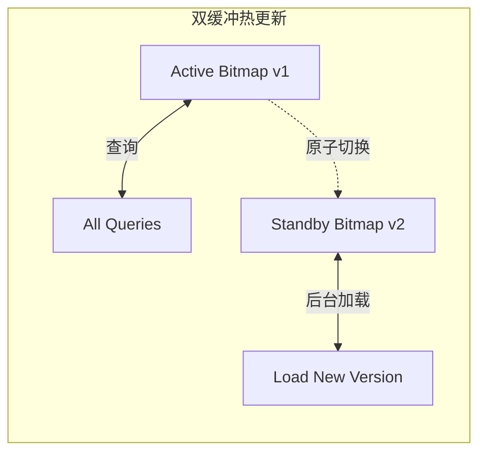
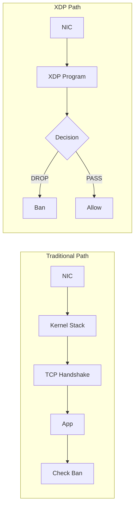
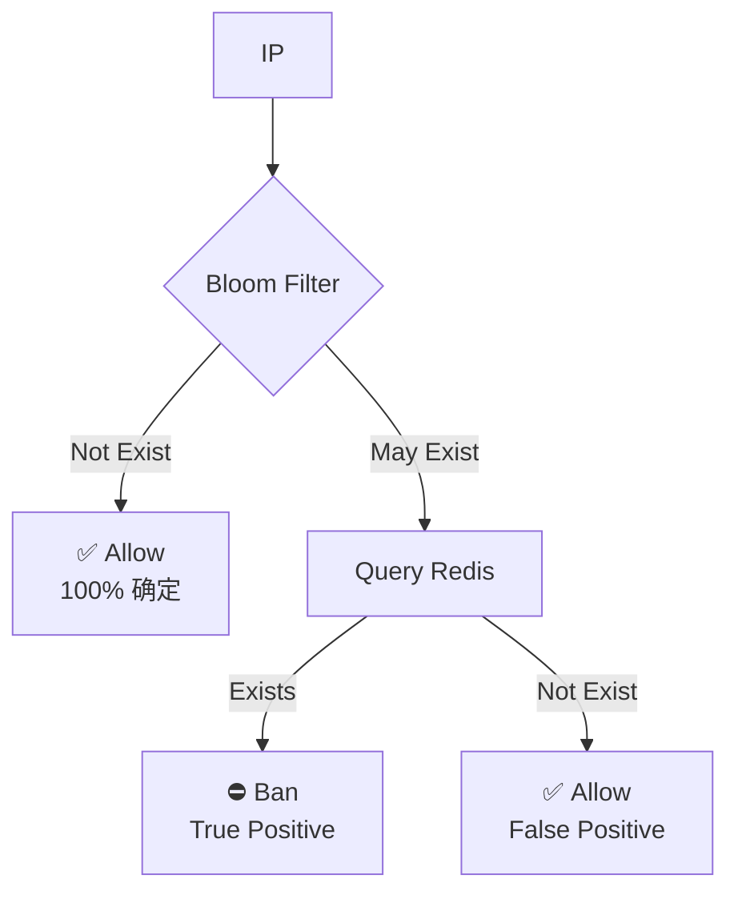
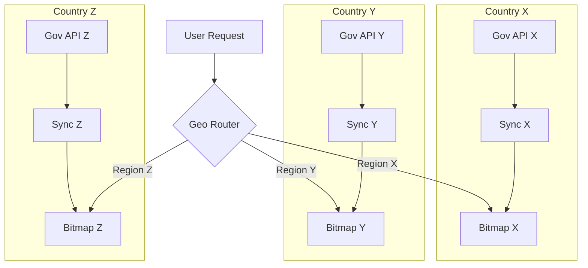
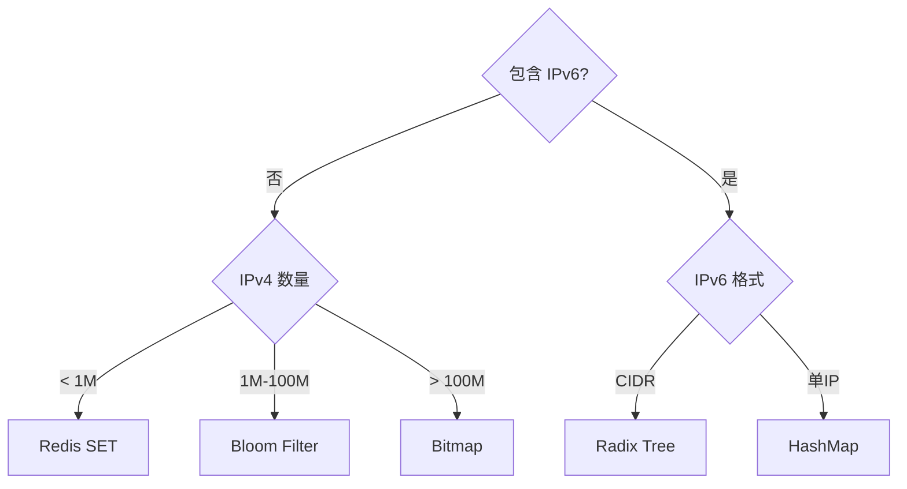

+++
title = "14.IPBan系统设计 (IP Blocking System)"
date = 2026-01-29
description = "系统设计面试真题：Large ScaleIPBan系统完整设计，包含IPv4 Bitmap、IPv6 Radix Tree、多层缓存、实when同步、Canary Release"
[taxonomies]
tags = ["系统设计", "面试", "IPBan", "Bitmap", "Radix Tree", "分布式"]
+++

# IP Ban系统设计 (IP Blocking System)

> **面试Frequency**：⭐⭐⭐⭐（高频题）
> **难度**：Medium偏难
> **考察重点**：Data结构选型、分布式缓存、实when同步、Compliance性设计

---

## 一、题目原文

> Imagine you're at a big internet company (like Twitter). Country X just passed a law that says we can't serve data to banned IP addresses (that is, if we receive a connection from a banned IP, we have to refuse). They expose an interface - `security.gov.x` - that tells us if an address is allowed or banned. The law goes into effect 2 months from now.
>
> You are in charge of dealing with this situation.

**翻译**：

假设你在一家大型互联网公司（e.g. Twitter）工作。X 国刚通过一项法律，规定我们不能向被Ban的 IP 地址提供服务（即e.g.果收到来自被Ban IP 的连接，必须拒绝）。Government开放了一个接口 `security.gov.x` 来Query某个 IP 是否被Ban。法律将在两个月behindeffective。

你负责Solution这个情况。

---

## 二、面试应对Strategy

### 2.1 核心思路

这是一道开放性系统设计题，面试官考察的是：

1. **Requirements Analysis能力** —— 能否通过提问明确边界条件
2. **技术选型能力** —— 不同规模下的最优解
3. **工程落地能力** —— e.g.何在 2 个月内安全Release
4. **风险意识** —— Compliance性、可用性、False BanSolution

### 2.2 Answer Framework

**回答框架 (45分钟)**

| 阶段 | 时间 | 内容 |
|------|------|------|
| 1. 澄清问题 | 5分钟 | 确认关键参数 |
| 2. 需求分析 | 5分钟 | 功能需求 + 非功能需求 |
| 3. 高层设计 | 10分钟 | 画架构图，解释核心组件 |
| 4. 深入设计 | 15分钟 | 数据结构、同步策略、缓存设计 |
| 5. 扩展讨论 | 10分钟 | 上线方案、监控告警、边界情况 |

---

## 三、Clarify Questions（Clarifying Questions）

### 3.1 必问Issue清单

在开始设计前，**必须**向面试官确认以下Issue：

| 类别 | Issue | 为什么重要 |
|------|------|-----------|
| **规模** | Banlist大概有多少 IP？10K？1000K？1000M？ | 决定存储Solution |
| **Type** | 只有 IPv4 还是包含 IPv6？ | Data结构完全不同 |
| **格式** | 是单个 IP 还是 CIDR 网段？ | Impact匹配算法 |
| **API** | Government API 支持批量Query还是逐个Query？ | ImpactSync Strategy |
| **when效** | Baneffective需要多实when？Seconds？Minutes？ | ImpactComplex architecture度 |
| **traffic** | 系统当前 QPS 是多少？ | Impact缓存设计 |
| **容错** | Government API 挂了怎么办？ | 需要Fallback Strategy |
| **白名单** | 是否有例外 IP（合作伙伴、CDN）？ | 白名单机制 |
| **历史Data** | 是否需要追溯之前的请求？ | 审计日志设计 |
| **多区域** | 是否有其他国家类似Requires？ | 架构扩展性 |

### 3.2 典型Scenario假设

根据面试官的回答，会有以下几种典型Scenario：

| 场景 | 封禁数量 | IP 类型 | 时效要求 | 推荐方案 |
|------|----------|---------|----------|----------|
| 简单场景 | < 100万 | IPv4 | 分钟级 | Redis SET |
| 中等场景 | 100万-1亿 | IPv4 | 分钟级 | Bloom + Redis |
| 大规模 | > 1亿 | IPv4 | 分钟级 | Bitmap (512MB) |
| IPv6 场景 | 任意 | IPv6/混合 | 分钟级 | Radix Tree |
| 极端实时 | 任意 | 任意 | 秒级 | 推送 + 本地缓存 |

### 6.2 缓存 TTL 设计

**缓存 TTL 权衡**

| TTL 设置 | 优点 | 缺点 |
|----------|------|------|
| 太短 (1秒) | 封禁生效快 | 缓存命中率低 |
| 太长 (1小时) | 命中率高，性能好 | 解封延迟长 |

**推荐策略**:
- 被封禁 IP: TTL = 同步间隔 (5分钟)
- 正常 IP: TTL = 1-5 分钟
- 热点 IP: LRU 自动管理
- **关键**: 增量同步时主动清除相关缓存

### 6.3 热更新机制



**更新步骤**:
1. 后台下载新版本到 Standby
2. 验证 checksum
3. 原子切换指针
4. 等待旧请求完成 (5秒)
5. 释放旧版本内存

### 6.4 Fallback Strategy

```
┌─────────────────────────────────────────────────────────────────┐
│                        Fallback Strategy                                  │
├─────────────────────────────────────────────────────────────────┤
│                                                                 │
│  Scenario1: Government API 不可用                                          │
│  ───────────────────────                                        │
│  • Trigger: 3 consecutive sync failures                                       │
│  • Strategy: Use local snapshot                                │
│  • Alert: P1 levelAlert，notify On-Call                               │
│  • Compliance: Log audit, using cached data                          │
│                                                                 │
│  Scenario2: Edge node data corrupted                                         │
│  ───────────────────────                                        │
│  • Detect: checksum validation failed                                       │
│  • Strategy: Auto rollback to prev version                                      │
│  • Alert: P2 levelAlert                                             │
│                                                                 │
│  Scenario3: Large ScaleFalse Ban (Emergency rollback)                                    │
│  ───────────────────────                                        │
│  • Trigger: Ban rate spike or Complaints surge                              │
│  • Strategy: One-click disable, allow all                                  │
│  • Permission: Requires SRE lead approval                                     │
│                                                                 │
│  Priority Decision:                                                     │
│  ┌─────────────────────────────────────────────────────────┐    │
│  │  ComplianceMode (default): Reject when uncertain                        │    │
│  │  Availability mode:      Allow when uncertain (needs approval)               │    │
│  └─────────────────────────────────────────────────────────┘    │
│                                                                 │
└─────────────────────────────────────────────────────────────────┘
```

---

## 七、ReleaseSolution（Go Live）

### 7.1 阶段规划

```
┌─────────────────────────────────────────────────────────────────┐
│                     8 Week Go-Live Plan                                 │
├─────────────────────────────────────────────────────────────────┤
│                                                                 │
│  Week 1-2: Infrastructure                                              │
│  ─────────────────────                                          │
│  • Connect Gov API, confirm specs                                    │
│  • Build sync service prototype                                              │
│  • Decide data structure (Bitmap/Radix Tree)                              │
│                                                                 │
│  Week 3-4: Core Development                                              │
│  ─────────────────────                                          │
│  • Implement sync service (full + incremental)                                    │
│  • Implement edge filter module                                          │
│  • Unit test + Integration test                                           │
│                                                                 │
│  Week 5: Shadow Mode (Shadow Mode)                                    │
│  ─────────────────────                                          │
│  • Deploy to production                                                │
│  • Log only, no actual ban                                        │
│  • Verify hit rate, FP rate、Latency                                      │
│                                                                 │
│  Week 6: Canary Release                                                │
│  ─────────────────────                                          │
│  • Day 1: 1% traffic with ban enabled                                        │
│  • Day 2: 5% traffic                                                │
│  • Day 3: 20% traffic                                               │
│  • Day 4: 50% traffic                                               │
│  • 24h observation each stage                                            │
│                                                                 │
│  Week 7: fullRelease                                                │
│  ─────────────────────                                          │
│  • 100% traffic with ban enabled                                             │
│  • 7×24 On-call standby                                                 │
│  • PrepareEmergency rollbackSolution                                              │
│                                                                 │
│  Week 8: Buffer Period                                                  │
│  ─────────────────────                                          │
│  • SolutionremainingIssue                                                  │
│  • Performance tuning                                                      │
│  • Documentation                                                      │
│                                                                 │
└─────────────────────────────────────────────────────────────────┘
```

### 7.2 Release检查清单

| 项目 | 验收标准 | 负责人 |
|------|---------|--------|
| 同步normal | 最近一time同步 < 10 min | SRE |
| 覆盖率 | 所有边缘节点版本一致 | SRE |
| Latency | P99 < 1ms | 性能团队 |
| False Ban率 | < 0.001% | QA |
| 审计日志 | Every 条Ban有完整记录 | Compliance团队 |
| 回滚能力 | 5 min内可关闭filter | SRE |
| 监控Alert | 核心指标Alert覆盖 | SRE |
| 文档 | 运维手册、应急预案 | 研发 |

---

## 八、监控与Alert

### 8.1 核心指标

```
┌─────────────────────────────────────────────────────────────────┐
│                        Monitoring Metrics                                  │
├─────────────────────────────────────────────────────────────────┤
│                                                                 │
│  Business Metrics                                                        │
│  ─────────────────────                                          │
│  • ip_filter_requests_total     # Total requests                      │
│  • ip_filter_blocked_total      # Blocked count                      │
│  • ip_filter_blocked_rate       # Ban rate (AnomalyDetect)             │
│                                                                 │
│  Performance Metrics                                                        │
│  ─────────────────────                                          │
│  • ip_filter_latency_p50        # QueryLatency P50                  │
│  • ip_filter_latency_p99        # QueryLatency P99                  │
│  • ip_filter_cache_hit_rate     # Cache hit rate                    │
│                                                                 │
│  Sync Metrics                                                        │
│  ─────────────────────                                          │
│  • sync_last_success_timestamp  # Last sync time              │
│  • sync_duration_seconds        # Sync duration                      │
│  • sync_errors_total            # Sync errors                  │
│  • sync_ip_count                # Total banned IPs                  │
│                                                                 │
│  Consistency Metrics                                                      │
│  ─────────────────────                                          │
│  • edge_node_version_mismatch   # Version mismatch nodes            │
│  • data_checksum_errors         # Datavalidation failed                  │
│                                                                 │
└─────────────────────────────────────────────────────────────────┘
```

### 8.2 Alert规则

| Alert | 条件 | level | Solution |
|------|------|------|------|
| 同步失败 | 连续 3 time失败 | P1 | 立即Solution |
| Ban rate飙升 | > 2倍日常值 | P1 | 检查是否False Ban |
| Latency升高 | P99 > 10ms | P2 | 排查性能Issue |
| 版本不一致 | > 10% 节点 | P2 | 强制同步 |
| Cache hit rate下降 | < 80% | P3 | 调整缓存Strategy |

---

## 九、边界情况与风险

### 9.1 技术风险

| 风险 | Impact | 缓解措施 |
|------|------|---------|
| Government API 不稳定 | Cannot同步最新Data | 本地fast照 + 指数退避重试 |
| Banlist暴增 | 内存不足 | Bitmap 固定Size，Radix Tree 分片 |
| 网络分区 | 部分节点Data过期 | 版本号校验 + Fallback Strategy |
| when钟不同步 | 审计日志混乱 | 使用 NTP，日志带when区 |

### 9.2 业务风险

| 风险 | Impact | 缓解措施 |
|------|------|---------|
| False Bannormalusers | users投诉、品牌受损 | 白名单机制 + fast速申诉通道 |
| 漏封违规 IP | Compliance风险 | 宁可多封不可漏封 |
| 法律定义模糊 | 实施标准不清 | 法务确认，书面留档 |
| 多国法律冲突 | Country Y 禁止Ban | 按地区隔离Strategy |

### 9.3 特殊Scenario

```
┌─────────────────────────────────────────────────────────────────┐
│                      Special Scenarios                                │
├─────────────────────────────────────────────────────────────────┤
│                                                                 │
│  NAT/NAT/Proxy Scenario                                                    │
│  ─────────────────────                                          │
│  Issue: Multi-user share same exit IP                                     │
│  Impact: Ban一个 IP mayImpactmanynormalusers                          │
│  Solution: No solution (Legal requirement)，but logImpactscope                         │
│                                                                 │
│  CDN/ReverseNAT/Proxy Scenario                                                │
│  ─────────────────────                                          │
│  Issue: Request via CDN, cant see real IP                               │
│  Solution: Use X-Forwarded-For, beware spoof                        │
│                                                                 │
│  Mobile Network Scenario                                                    │
│  ─────────────────────                                          │
│  Issue: Carrier IP pool dynamic alloc                                      │
│  Impact: Unbanned IP may go to other user                               │
│  Solution: Rely on gov list updates                                          │
│                                                                 │
│  InternaltrafficScenario                                                    │
│  ─────────────────────                                          │
│  Issue: Internal service calls filtered                                    │
│  Solution: Add internal IPs to whitelist                                      │
│                                                                 │
│  VPN/Tor Exit Nodes                                                │
│  ─────────────────────                                          │
│  Issue: User bypass ban via VPN/Tor                                 │
│  Solution: Maintain known VPN/Tor 出口 IP list，OptionalBan                   │
│  Note: May false ban normal VPN users                                     │
│                                                                 │
│  Cloud Provider IPs (AWS/GCP/Azure)                                     │
│  ─────────────────────                                          │
│  Issue: Attacker use cloud, IP changes often                           │
│  Solution: Rely on gov list updates，consider behavior analysis                    │
│                                                                 │
│  Dual-Stack Network (Dual-Stack)                                           │
│  ─────────────────────                                          │
│  Issue: Same user may have both IPv4 and IPv6                      │
│  Solution: Check both, ban if either blocked                        │
│  Note: IPv4-mapped IPv6 (::ffff:1.2.3.4) needs specialSolution              │
│                                                                 │
│  Anycast Scenario                                                    │
│  ─────────────────────                                          │
│  Issue: User may route to different edge nodes                            │
│  Solution: Ensure all nodes synced, same version                            │
│                                                                 │
│  IP Spoofing (Spoofing)                                              │
│  ─────────────────────                                          │
│  Issue: Attacker forge source IP                                           │
│  Solution: TCP handshake protects, UDP needs verify                          │
│                                                                 │
└─────────────────────────────────────────────────────────────────┘
```

---

## 十、补充设计要点

### 10.1 filter层级选择

```
┌─────────────────────────────────────────────────────────────────┐
│                     Filter Layer Comparison                                 │
├─────────────────────────────────────────────────────────────────┤
│                                                                 │
│  Layer 3/4 (Network/Transport Layer)                                       │
│  ─────────────────────────                                      │
│  Location: Firewall, Load Balancer、eBPF/XDP                              │
│  Pros: Ultra low latency (<1μs)，Low CPU overhead                               │
│  Cons: Cannot get HTTP headers                                      │
│  Use case: Large scale ban, perf sensitive                                  │
│                                                                 │
│  Layer 7 (Application Layer)                                                │
│  ─────────────────────────                                      │
│  Location: Nginx、App code                                           │
│  Pros: Can get XFF, flexible response                      │
│  Cons: Higher latency, more resources                                      │
│  Use case: Need to identify real IP (CDN behind)                                  │
│                                                                 │
│  Recommended: Dual layer filter                                                  │
│  ┌─────────────────────────────────────────────────────────┐    │
│  │  L3/4: Fast filter known banned IPs (eBPF/iptables)              │    │
│  │  L7:   Solution CDN Scenario，preciselyCheckreal IP                   │    │
│  └─────────────────────────────────────────────────────────┘    │
│                                                                 │
└─────────────────────────────────────────────────────────────────┘
```

### 10.2 eBPF/XDP 高性能过滤（加分项）

**Traditional Path vs XDP Path**:



**性能对比**:

| 方案 | 延迟 | 吞吐 |
|------|------|------|
| 应用层过滤 | ~100 μs | 100K pps |
| iptables | ~10 μs | 1M pps |
| eBPF/XDP | ~1 μs | 10M+ pps |

**限制**: XDP 无法读取 HTTP 头，不能处理 CDN 场景。

### 10.3 Bloom Filter 方案（中等规模）

**原理**: 概率数据结构，允许假阳性 (FP)，不允许假阴性 (FN)。



**参数设计** (1亿 IP, 1% 假阳性率):
- Bloom Filter 大小: ~120 MB
- Hash 函数数量: 7
- 99% 请求在 Bloom Filter 层结束
- 1% 假阳性需要查询 Redis 确认

**优点**: 内存占用小，查询快
**缺点**: 不支持删除（解封需要重建），有假阳性

### 10.4 CIDR 聚合优化

```
┌─────────────────────────────────────────────────────────────────┐
│                      CIDR Aggregation Strategy                               │
├─────────────────────────────────────────────────────────────────┤
│                                                                 │
│  Issue: Gov may send many consecutive IPs                 │
│                                                                 │
│  Example:                                                           │
│  ┌─────────────────────────────────────────────────────────┐    │
│  │  Original: 192.168.1.0, 192.168.1.1, ... 192.168.1.255      │    │
│  │  Aggregated: 192.168.1.0/24 (One rule replaces 256)            │    │
│  └─────────────────────────────────────────────────────────┘    │
│                                                                 │
│  实现Method:                                                       │
│  • IPv4 Bitmap: No aggregation needed                       │
│  • IPv6 Radix Tree: Native CIDR prefix match                       │
│  • Redis SET: 需要预Solution聚合，or使用 Sorted Set scopeQuery         │
│                                                                 │
│  Aggregation Algorithm:                                                       │
│  1. Convert IPs to int and sort                                   │
│  2. Identify continuous ranges                                                 │
│  3. Merge to max CIDR blocks                                           │
│  4. Use Patricia Trie for storage                                │
│                                                                 │
└─────────────────────────────────────────────────────────────────┘
```

### 10.5 long连接与 WebSocket Solution

```
┌─────────────────────────────────────────────────────────────────┐
│                   long连接ScenarioSolution                                 │
├─────────────────────────────────────────────────────────────────┤
│                                                                 │
│  Issue: users已建立连接behind被Ban，e.g.何Solution？                        │
│                                                                 │
│  Solution 1: Check on connect (Recommended)                                       │
│  ─────────────────────────                                      │
│  • Check IP only on connection                                         │
│  • 已建立连接不受新BanImpact                                      │
│  • Pros: 实现Simple，users体验好                                    │
│  • Cons: ExistsCompliance窗口期                                          │
│                                                                 │
│  Solution 2: Periodic recheck                                                │
│  ─────────────────────────                                      │
│  • Every  N min重新检查活跃连接的 IP                                │
│  • Disconnect when ban found                                        │
│  • Pros: Better Compliance                                              │
│  • Cons: Increases complexity                                          │
│                                                                 │
│  Solution 3: Event driven                                                │
│  ─────────────────────────                                      │
│  • Push to conn manager on ban update                              │
│  • Conn manager disconnects matched                                  │
│  • Pros: Best real-time                                              │
│  • Cons: Complex architecture                                                │
│                                                                 │
│  Recommended: Solution 1 + periodic full recheck (hourly)                            │
│                                                                 │
└─────────────────────────────────────────────────────────────────┘
```

### 10.6 real IP 获取Strategy

```
┌─────────────────────────────────────────────────────────────────┐
│                   Real IP Identification                                   │
├─────────────────────────────────────────────────────────────────┤
│                                                                 │
│  Scenario: Request via CDN/LB/proxy, direct IP is proxy server                │
│                                                                 │
│  Request chain:                                                       │
│  User (1.2.3.4) ──▶ CDN (5.6.7.8) ──▶ LB (10.0.0.1) ──▶ App    │
│                                                                 │
│  获取real IP 的Method:                                             │
│  ┌─────────────────────────────────────────────────────────┐    │
│  │  Header              │ Example值                           │    │
│  ├──────────────────────┼──────────────────────────────────┤    │
│  │  X-Forwarded-For     │ 1.2.3.4, 5.6.7.8                 │    │
│  │  X-Real-IP           │ 1.2.3.4                          │    │
│  │  CF-Connecting-IP    │ 1.2.3.4 (Cloudflare specific)        │    │
│  │  True-Client-IP      │ 1.2.3.4 (Akamai specific)            │    │
│  └─────────────────────────────────────────────────────────┘    │
│                                                                 │
│  Security Risk: X-Forwarded-For Can be spoofed!                             │
│                                                                 │
│  Protection Strategy:                                                       │
│  ┌─────────────────────────────────────────────────────────┐    │
│  │  1. Trust headers from known proxies only                           │    │
│  │  2. Config trusted proxy list (CDN IP range)                         │    │
│  │  3. Parse XFF right-to-left, get first untrusted      │    │
│  │  4. For suspicious, ban both direct and claimed IP        │    │
│  └─────────────────────────────────────────────────────────┘    │
│                                                                 │
└─────────────────────────────────────────────────────────────────┘
```

### 10.7 错误响应设计

```
┌─────────────────────────────────────────────────────────────────┐
│                   Ban Response Design                                   │
├─────────────────────────────────────────────────────────────────┤
│                                                                 │
│  HTTP Status Code Selection:                                                │
│  ┌──────────────────────────────────────────────────────────┐   │
│  │  403 Forbidden      - Most common, clear access denied           │   │
│  │  451 Unavailable    - Unavailable for legal reasons (RFC 7725)        │   │
│  │       For Legal                                          │   │
│  │       Reasons       - Recommended用于GovernmentComplianceScenario               │   │
│  └──────────────────────────────────────────────────────────┘   │
│                                                                 │
│  Response Content (Needs legal review):                                          │
│  ┌──────────────────────────────────────────────────────────┐   │
│  │  {                                                       │   │
│  │    "error": "access_denied",                             │   │
│  │    "message": "Access to this service is not available   │   │
│  │                in your region.",                         │   │
│  │    "support": "support@company.com"                      │   │
│  │  }                                                       │   │
│  └──────────────────────────────────────────────────────────┘   │
│                                                                 │
│  Note事项:                                                       │
│  • Dont reveal ban reason (Avoid leaking Strategy)                           │
│  • Dont show user IP (Privacy protection)                                    │
│  • 提供客服联系Method (SolutionFalse Ban)                                   │
│  • Response Content需多语言支持                                          │
│                                                                 │
└─────────────────────────────────────────────────────────────────┘
```

### 10.8 Government API 对接细节

```
┌─────────────────────────────────────────────────────────────────┐
│                   Government API 对接考量                              │
├─────────────────────────────────────────────────────────────────┤
│                                                                 │
│  需确认的接口规格:                                               │
│  ┌──────────────────────────────────────────────────────────┐   │
│  │  Issue                      │ Impact                        │   │
│  ├────────────────────────────┼─────────────────────────────┤   │
│  │  认证Method (API Key/mTLS)   │ 安全架构设计                │   │
│  │  速率Limitation                  │ Sync Strategy设计                │   │
│  │  Data格式 (JSON/Protobuf)  │ 解析逻辑                    │   │
│  │  分页Method                  │ Full Sync实现                │   │
│  │  incremental接口 (有/无)          │ 同步效率                    │   │
│  │  SLA 保证                  │ Fallback Strategy设计                │   │
│  │  变更notify (Push/轮询)      │ 实when性                      │   │
│  │  测试环境                  │ 开发调试                    │   │
│  └──────────────────────────────────────────────────────────┘   │
│                                                                 │
│  安全Requires:                                                       │
│  • 使用 mTLS 双向认证                                            │
│  • API 密钥定期轮换                                              │
│  • 传输加密 (TLS 1.3)                                            │
│  • 审计所有 API 调用                                             │
│                                                                 │
│  容错设计:                                                       │
│  • 指数退避重试                                                  │
│  • 熔断器Mode (连续失败behind暂停调用)                               │
│  • 备用 API 端点                                                 │
│  • 离线Mode (使用Local Cache)                                       │
│                                                                 │
└─────────────────────────────────────────────────────────────────┘
```

### 10.9 Data隐私Compliance (GDPR)

```
┌─────────────────────────────────────────────────────────────────┐
│                   Data隐私考量                                   │
├─────────────────────────────────────────────────────────────────┤
│                                                                 │
│  IP 地址是否属于个人Data?                                        │
│  ───────────────────────                                        │
│  • GDPR 观点: 是 (可关联到个人)                                  │
│  • Impact: 存储和Solution需要合法依据                                  │
│                                                                 │
│  Compliance措施:                                                       │
│  ┌──────────────────────────────────────────────────────────┐   │
│  │  1. 法律依据: "合法利益" or "法律义务"                   │   │
│  │  2. Data最小化: 只存储必要信息                           │   │
│  │  3. 保留期限: 明确日志保留when间                           │   │
│  │  4. 访问控制: Limitation谁能访问Banlist                       │   │
│  │  5. 审计追踪: 记录谁访问了Data                           │   │
│  └──────────────────────────────────────────────────────────┘   │
│                                                                 │
│  审计日志保留:                                                   │
│  • Ban记录: 按法规Requires (通常 2-7 年)                            │
│  • 访问日志: 90 天 (性能考虑)                                    │
│  • 需要与法务确认具体Requires                                        │
│                                                                 │
└─────────────────────────────────────────────────────────────────┘
```

### 10.10 容量规划与扩展

```
┌─────────────────────────────────────────────────────────────────┐
│                      容量规划                                    │
├─────────────────────────────────────────────────────────────────┤
│                                                                 │
│  当前容量 vs 未来增long                                            │
│  ─────────────────────────                                      │
│  • Ban IP 数量: 当前 100M → 未来 1000M (Bitmap 无Impact)            │
│  • QPS: 当前 1000K → 未来 10000K (需增加边缘节点)                │
│  • 边缘节点: 当前 50 → 未来 200 (CDN 成本线性增long)               │
│                                                                 │
│  扩展Strategy                                                        │
│  ─────────────────────────                                      │
│  ┌──────────────────────────────────────────────────────────┐   │
│  │  维度           │ 扩展Method                               │   │
│  ├──────────────────┼───────────────────────────────────────┤   │
│  │  QPS            │ 增加边缘节点 (水平扩展)                │   │
│  │  IPv4 数量      │ Bitmap 固定 512MB，无需扩展            │   │
│  │  IPv6 数量      │ Radix Tree 分片，按前缀分区            │   │
│  │  同步Frequency       │ 增加同步服务实例，分区并行             │   │
│  │  存储           │ S3 自动扩展，增加版本保留              │   │
│  └──────────────────────────────────────────────────────────┘   │
│                                                                 │
│  瓶颈分析                                                        │
│  ─────────────────────────                                      │
│  • Government API 速率Limitation → 多账号/IP 轮询                            │
│  • CDN 带宽 → Incremental Sync减少传输量                                 │
│  • 边缘节点内存 → IPv6 Radix Tree 分片                           │
│                                                                 │
└─────────────────────────────────────────────────────────────────┘
```

### 10.11 Data主权与地理隔离

**Scenario**: 多个国家有类似封禁要求



**关键原则**:
- 封禁列表按国家隔离存储
- 边缘节点只加载服务区域的规则
- 审计日志按国家分区存储
- 避免跨境数据传输 (GDPR/数据本地化)

**冲突处理**:
- Country X 要求封禁，Country Y 要求不能封禁
- 解决: 按用户所在地区应用规则
- 法务确认: 书面记录决策依据

### 10.12 安全加固

```
┌─────────────────────────────────────────────────────────────────┐
│                      安全考量                                    │
├─────────────────────────────────────────────────────────────────┤
│                                                                 │
│  Banlist保护                                                    │
│  ─────────────────────────                                      │
│  • 威胁: Banlist泄露may被利用 (攻击者知道哪些 IP 被监控)       │
│  • 措施:                                                         │
│    - 传输加密 (TLS 1.3)                                          │
│    - 存储加密 (S3 SSE-S3 or SSE-KMS)                             │
│    - 访问控制 (IAM 最小Permission)                                     │
│    - 审计日志 (谁访问了Banlist)                                 │
│                                                                 │
│  API 安全                                                        │
│  ─────────────────────────                                      │
│  • Government API 认证: mTLS 双向认证                                  │
│  • Internal API: JWT + RBAC                                          │
│  • 密钥管理: HashiCorp Vault or AWS Secrets Manager              │
│  • 密钥轮换: Every  90 天自动轮换                                    │
│                                                                 │
│  防篡改                                                          │
│  ─────────────────────────                                      │
│  • Bitmap 文件签名: SHA-256 + 数字签名                           │
│  • 边缘节点验证签名behind才加载                                      │
│  • 签名密钥与Data分离存储                                        │
│                                                                 │
│  DDoS 防护                                                       │
│  ─────────────────────────                                      │
│  • IP filter与 DDoS 防护解耦                                       │
│  • eBPF 在Kernel层filter，不消耗Application Layer资源                           │
│  • 速率Limitation在 IP filter之前                                        │
│                                                                 │
└─────────────────────────────────────────────────────────────────┘
```

### 10.13 测试Strategy

```
┌─────────────────────────────────────────────────────────────────┐
│                      测试Strategy                                    │
├─────────────────────────────────────────────────────────────────┤
│                                                                 │
│  Unit test                                                        │
│  ─────────────────────                                          │
│  • Bitmap 位操作正确性                                           │
│  • IP 解析和转换                                                 │
│  • CIDR 匹配逻辑                                                 │
│  • 缓存 TTL 过期                                                 │
│                                                                 │
│  Integration test                                                        │
│  ─────────────────────                                          │
│  • 同步服务与 Mock Government API                                      │
│  • 边缘节点Data更新                                              │
│  • 多节点一致性                                                  │
│                                                                 │
│  性能测试                                                        │
│  ─────────────────────                                          │
│  • QueryLatency (目标: P99 < 1ms)                                    │
│  • Throughput量 (目标: 1000K+ QPS)                                     │
│  • Sync duration (1000M IP Full Sync)                                   │
│                                                                 │
│  混沌测试                                                        │
│  ─────────────────────                                          │
│  • Government API 不可用                                               │
│  • Redis 宕机                                                    │
│  • 网络分区                                                      │
│  • Data损坏                                                      │
│                                                                 │
│  影子测试 (Shadow Testing)                                       │
│  ─────────────────────                                          │
│  • 复制生产traffic到测试环境                                        │
│  • 对比filter结果，验证准确性                                      │
│  • 不Impactrealusers                                                │
│                                                                 │
│  回归测试                                                        │
│  ─────────────────────                                          │
│  • 已知Ban IP list验证                                          │
│  • 边界 IP 测试 (0.0.0.0, 255.255.255.255)                       │
│  • IPv4-mapped IPv6 地址 (::ffff:192.168.1.1)                    │
│                                                                 │
│  边界用例完整清单                                                 │
│  ─────────────────────                                          │
│  • 空Banlist                                                    │
│  • fullBan (4300M IPv4 全封)                                     │
│  • 单 IP Ban/解封循环                                           │
│  • CIDR /0 (全网段)                                              │
│  • CIDR /32 (单 IP)                                              │
│  • 重叠 CIDR (10.0.0.0/8 和 10.1.0.0/16)                         │
│  • 私有 IP range (10.x, 172.16.x, 192.168.x)                        │
│  • 环回地址 (127.0.0.1, ::1)                                     │
│  • 多播地址 (224.0.0.0/4)                                        │
│  • 链路本地地址 (169.254.x.x, fe80::)                            │
│                                                                 │
└─────────────────────────────────────────────────────────────────┘
```

---

## 十一、面试加分点

### 11.1 主动提及的亮点

1. **Compliance意识**：主动提到审计日志、法务确认、责任边界
2. **Canary Release**：不是一刀切，而是渐进式Release
3. **Fallback Strategy**：考虑各种故障Scenario
4. **成本意识**：Bitmap Solution比 Redis 省钱省资源
5. **IPv6 前瞻**：主动考虑 IPv6 Scenario

### 11.2 e.g.果when间允许，可以讨论

- **分布式一致性**：e.g.何保证全球节点Data一致
- **安全性**：防止Banlist泄露
- **性能优化**：SIMD 指令加速 Bitmap Query
- **容量规划**：traffic增longbehind的扩展Solution

### 11.3 常见追问

| Issue | 回答要点 |
|------|---------|
| e.g.何保证零漏封？ | 宁可False Ban不可漏封 + 多层校验 + Bitmap 无假阴性 |
| LatencyRequires更高怎么办？ | eBPF/XDP + 边缘节点本地化 + 内存Data结构 |
| Banlist是机密的怎么办？ | mTLS + 端到端加密 + 访问审计 + 最小Permission原则 |
| e.g.何测试？ | 影子Mode + 回放历史traffic + 混沌测试 |
| 多个国家都有类似Requires？ | 分区域独立Banlist + 统一框架 + 按地理Location路由 |
| Banlist突然增加 10 倍？ | Bitmap 固定 512MB 无Impact；Radix Tree 需要分片 |
| e.g.何SolutionFalse Ban投诉？ | fast速申诉通道 + 白名单临whenAllow + 审计追溯 |
| CDN behind面看不到real IP？ | X-Forwarded-For + 可信代理list + 从右向左解析 |
| long连接users被Ban？ | Periodic recheck + 主动断开 + 优雅关闭 |
| e.g.何防止 DDoS 攻击？ | eBPF 前置filter + 速率Limitation + 与Ban解耦 |

### 11.4 成本估算

```
┌─────────────────────────────────────────────────────────────────┐
│                      成本估算 (月度)                             │
├─────────────────────────────────────────────────────────────────┤
│                                                                 │
│  Solution A: Redis SET (小规模)                                      │
│  ─────────────────────────                                      │
│  • Redis Cluster (3主3从): ~$2,000/月                           │
│  • 同步服务 (2 实例): ~$200/月                                   │
│  • 总计: ~$2,200/月                                              │
│                                                                 │
│  Solution B: Bitmap (Large Scale IPv4)                                    │
│  ─────────────────────────                                      │
│  • S3 存储 (512MB × 版本): ~$10/月                               │
│  • CDN 分发: ~$500/月                                            │
│  • 同步服务: ~$200/月                                            │
│  • 边缘节点额外内存 (+512MB × N): 已有成本                       │
│  • 总计: ~$710/月                                                │
│                                                                 │
│  Solution C: Radix Tree (IPv6)                                       │
│  ─────────────────────────                                      │
│  • S3 存储 (40GB × 版本): ~$100/月                               │
│  • CDN 分发: ~$2,000/月                                          │
│  • 边缘节点额外内存 (+40GB × N): ~$5,000/月                      │
│  • 总计: ~$7,100/月                                              │
│                                                                 │
│  隐性成本:                                                       │
│  • 开发人力: 2-3 人 × 2 月 = ~$80,000 (一time性)                   │
│  • 运维人力: 0.5 FTE = ~$5,000/月                                │
│  • Compliance审计: ~$10,000/年                                         │
│                                                                 │
└─────────────────────────────────────────────────────────────────┘
```

### 11.5 SLI/SLO 定义

```
┌─────────────────────────────────────────────────────────────────┐
│                      SLI/SLO 定义                                │
├─────────────────────────────────────────────────────────────────┤
│                                                                 │
│  可用性 SLO                                                      │
│  ─────────────────────────                                      │
│  • SLI: 成功Solution的请求数 / Total requests                              │
│  • SLO: 99.99% (Every 月最多 4.3 min不可用)                         │
│  • 错误预算: 0.01% 请求可失败                                    │
│                                                                 │
│  Latency SLO                                                        │
│  ─────────────────────────                                      │
│  • SLI: IP 检查Latency                                              │
│  • SLO: P50 < 100μs, P99 < 1ms, P99.9 < 10ms                    │
│                                                                 │
│  Data新鲜度 SLO                                                  │
│  ─────────────────────────                                      │
│  • SLI: Last sync time                                         │
│  • SLO: 同步Latency < 10 min (99.9%)                               │
│  • Full Sync: Every  24 hour至少 1 time                                 │
│                                                                 │
│  准确性 SLO                                                      │
│  ─────────────────────────                                      │
│  • 假阴性率 (漏封): 0% (硬性Requires)                                │
│  • False positive率 (False Ban): < 0.001%                                     │
│                                                                 │
│  一致性 SLO                                                      │
│  ─────────────────────────                                      │
│  • SLI: 版本一致的边缘节点比例                                   │
│  • SLO: > 99% 节点版本一致                                       │
│                                                                 │
└─────────────────────────────────────────────────────────────────┘
```

### 11.6 运维手册要点

```
┌─────────────────────────────────────────────────────────────────┐
│                      Runbook 核心Scenario                            │
├─────────────────────────────────────────────────────────────────┤
│                                                                 │
│  Scenario 1: 同步失败Alert                                            │
│  ─────────────────────────                                      │
│  1. 检查Government API 状态 (curl https://security.gov.x/health)       │
│  2. 检查同步服务日志 (kubectl logs sync-service-xxx)            │
│  3. 检查网络连通性 (是否被防火墙拦截)                            │
│  4. 若 API 不可用，确认使用本地fast照继续服务                      │
│  5. notify法务团队，记录事件                                       │
│  6. 升级: 30 min未恢复 → P1 On-Call                             │
│                                                                 │
│  Scenario 2: Ban rateAnomaly飙升                                          │
│  ─────────────────────────                                      │
│  1. 检查最近同步内容 (是否有大批量新增)                          │
│  2. 对比前behind版本 diff (多了哪些 IP/CIDR)                         │
│  3. 抽样检查被Ban请求 (是否有False Ban迹象)                          │
│  4. 若确认False Ban:                                                  │
│     a. 回滚到上一版本                                            │
│     b. or: 启用紧急开关，暂停filter                                │
│  5. notify产品/法务，评估Impact                                      │
│                                                                 │
│  Scenario 3: 边缘节点版本不一致                                      │
│  ─────────────────────────                                      │
│  1. 识别不一致节点 (监控面板)                                    │
│  2. 检查节点网络/CDN 拉取状态                                    │
│  3. 手动Trigger同步: curl -X POST /admin/sync                       │
│  4. 若持续失败，隔离节点 (从 LB 摘除)                            │
│  5. 修复behind重新Release                                               │
│                                                                 │
│  Scenario 4: 紧急fullAllow                                            │
│  ─────────────────────────                                      │
│  Trigger条件: Large ScaleFalse Ban，业务严重受损                              │
│  操作: kubectl set env deployment/edge-filter FILTER_ENABLED=false│
│  审批: 需 SRE 负责人 + 法务确认                                  │
│  恢复: 修复behind重新启用，逐步灰度                                  │
│                                                                 │
└─────────────────────────────────────────────────────────────────┘
```

### 11.7 Feature Flags 设计

```
┌─────────────────────────────────────────────────────────────────┐
│                      Feature Flags                               │
├─────────────────────────────────────────────────────────────────┤
│                                                                 │
│  ip_filter.enabled                                               │
│  ─────────────────────────                                      │
│  • 描述: 总开关，控制是否启用 IP filter                            │
│  • default: true (生产), false (开发)                               │
│  • 用途: Emergency rollback                                                │
│                                                                 │
│  ip_filter.mode                                                  │
│  ─────────────────────────                                      │
│  • 值: "enforce" | "shadow" | "log_only"                        │
│  • enforce: realBan                                             │
│  • shadow: 记录日志但不Ban                                      │
│  • log_only: 只记录匹配，不执行任何动作                          │
│                                                                 │
│  ip_filter.rollout_percentage                                    │
│  ─────────────────────────                                      │
│  • 描述: 灰度比例 (0-100)                                        │
│  • 用途: 渐进式Release                                              │
│  • 实现: hash(request_id) % 100 < percentage                    │
│                                                                 │
│  ip_filter.whitelist_enabled                                     │
│  ─────────────────────────                                      │
│  • 描述: 是否启用白名单                                          │
│  • 用途: 豁免特定 IP (合作伙伴、Internal服务)                        │
│                                                                 │
│  ip_filter.fail_mode                                             │
│  ─────────────────────────                                      │
│  • 值: "open" | "closed"                                        │
│  • open: 出错whenAllow (可用性优先)                                 │
│  • closed: 出错whenBan (Compliance优先, default)                           │
│                                                                 │
└─────────────────────────────────────────────────────────────────┘
```

### 11.8 团队与职责

```
┌─────────────────────────────────────────────────────────────────┐
│                      团队职责矩阵                                │
├─────────────────────────────────────────────────────────────────┤
│                                                                 │
│  角色              │ 职责                                        │
│  ─────────────────────────────────────────────────────────────  │
│  Tech Lead         │ 架构设计、技术决策、代码审查                │
│  Backend Engineer  │ 同步服务开发、Data结构实现                  │
│  Infra Engineer    │ 边缘节点集成、eBPF 开发                     │
│  SRE               │ 部署、监控、On-Call、Runbook                │
│  QA                │ 测试Strategy、性能测试、混沌测试                │
│  Legal/Compliance  │ Compliance确认、审计Requires、责任边界                │
│  Product Manager   │ 需求对接、利益相关者沟通                    │
│                                                                 │
│  人力估算:                                                       │
│  ┌──────────────────────────────────────────────────────────┐   │
│  │  Phase 1-4 (开发): 2 Backend + 1 Infra + 0.5 SRE         │   │
│  │  Phase 5-7 (Release): 1 Backend + 1 SRE + 0.5 QA            │   │
│  │  Phase 8+ (维护): 0.5 SRE (日常运维)                     │   │
│  └──────────────────────────────────────────────────────────┘   │
│                                                                 │
└─────────────────────────────────────────────────────────────────┘
```

### 11.9 常见错误与反Mode

```
┌─────────────────────────────────────────────────────────────────┐
│                   面试常见错误 (避坑指南)                        │
├─────────────────────────────────────────────────────────────────┤
│                                                                 │
│  ❌ 错误 1: Every time请求都调用Government API                               │
│  ─────────────────────────                                      │
│  Issue: Latency高、成本高、单点故障                                  │
│  正解: Local Cache/同步，批量拉取                                   │
│                                                                 │
│  ❌ 错误 2: 使用 HashSet 存储 10 00M IP                           │
│  ─────────────────────────                                      │
│  Issue: 内存占用 40+ GB，Redis Cannot承受                           │
│  正解: Bitmap (512MB) or Bloom Filter                           │
│                                                                 │
│  ❌ 错误 3: IPv6 也用 Bitmap                                     │
│  ─────────────────────────                                      │
│  Issue: 2^128 个地址，Cannot存储                                    │
│  正解: Radix Tree or分层 HashMap                                │
│                                                                 │
│  ❌ 错误 4: 一time性fullRelease                                       │
│  ─────────────────────────                                      │
│  Issue: Cannot验证正确性，出IssueImpactfullusers                        │
│  正解: Shadow Mode → 灰度 → full                                     │
│                                                                 │
│  ❌ 错误 5: 忽略 X-Forwarded-For 伪造风险                        │
│  ─────────────────────────                                      │
│  Issue: 攻击者可伪造 IP 绕过Ban                                  │
│  正解: 只信任可信代理，从右向左解析                              │
│                                                                 │
│  ❌ 错误 6: 没有Fallback Strategy                                         │
│  ─────────────────────────                                      │
│  Issue: Government API 挂了，系统Cannot工作                               │
│  正解: 本地fast照 + 离线Mode                                      │
│                                                                 │
│  ❌ 错误 7: 忽略Compliance/审计需求                                    │
│  ─────────────────────────                                      │
│  Issue: Cannot证明系统正确执行了Ban                                │
│  正解: 完整审计日志 + 可追溯                                    │
│                                                                 │
│  ❌ 错误 8: 只考虑技术不考虑when间                                 │
│  ─────────────────────────                                      │
│  Issue: Solution完美但 2 个月Cannot完成                                 │
│  正解: MVP 优先，迭代优化                                       │
│                                                                 │
│  ❌ 错误 9: Banbehind返回 200 OK                                    │
│  ─────────────────────────                                      │
│  Issue: users不知道被Ban，体验差                                  │
│  正解: 返回 403/451 + 友好错误信息                              │
│                                                                 │
│  ❌ 错误 10: 没有Emergency rollback机制                                    │
│  ─────────────────────────                                      │
│  Issue: Large ScaleFalse BanwhenCannotfast速恢复                                  │
│  正解: Feature Flag 一键关闭                                    │
│                                                                 │
└─────────────────────────────────────────────────────────────────┘
```

### 11.10 方案选择决策树

**决策 1: 数据结构选择**



**决策 2: 同步策略**

| 时效要求 | 推荐方案 |
|----------|----------|
| 秒级 | Kafka/WebSocket 推送 |
| 分钟级 | 增量轮询 (5min) |
| 小时级 | 全量同步 |

**决策 3: 架构复杂度**

| QPS 级别 | 推荐架构 |
|----------|----------|
| < 100K | 单层架构 |
| 100K - 1M | 本地缓存 + 分布式 |
| > 1M | 边缘节点 + eBPF |

---

## 十二、总结

### 核心Solution选择

| Scenario | Solution | 存储 | Latency | Use case QPS |
|------|---------|------|------|----------|
| IPv4 小规模 (< 1000K) | Redis SET + 本地 LRU | 1-2 GB | ~1 ms | < 500K |
| IPv4 中规模 (1000K-100M) | Bloom Filter + Redis | 120 MB + Redis | ~100 ns + 1ms fallback | < 1000K |
| IPv4 Large Scale (> 100M) | Bitmap | 512 MB | ~50 ns | 无限 |
| IPv6 / Mixed | Radix Tree + LRU | 20-40 GB | ~1-5 μs | 无限 |
| Ultimate Performance | eBPF/XDP + Bitmap | 512 MB | ~1 μs | 10000K+ |

### Key设计原则

| 原则 | 说明 |
|------|------|
| **本地化Query** | 避免网络开销，边缘节点自给自足 |
| **最终一致性** | 允许MinutesLatency，换取高可用 |
| **渐进式Release** | Shadow Mode → 灰度 1% → 5% → 20% → 50% → full |
| **宁严勿松** | 不certainwhenBan，保证Compliance |
| **双缓冲更新** | 热更新不停机，Atomic Switch |
| **多层防护** | L3/4 fast速filter + L7 preciselyCheck |
| **完整审计** | Every timeBan可追溯，满足Compliance |

### 边界情况检查清单

| 类别 | 检查项 | 状态 | Solution |
|------|--------|------|------|
| **IP Type** | IPv4 单 IP | ✅ | Bitmap |
| | IPv4 CIDR | ✅ | Bitmap 预Solution展开 |
| | IPv6 单 IP | ✅ | Radix Tree |
| | IPv6 CIDR | ✅ | Radix Tree 原生支持 |
| | IPv4-mapped IPv6 | ✅ | 解析behind按 IPv4 Solution |
| | 私有 IP (10.x, 192.168.x) | ✅ | 白名单or按规则Ban |
| | 环回地址 (127.0.0.1) | ✅ | 永久白名单 |
| | 多播/广播地址 | ✅ | 跳过检查 |
| **网络Scenario** | 直连users | ✅ | 直接检查源 IP |
| | CDN behindusers | ✅ | X-Forwarded-For + 可信代理 |
| | NAT behindusers | ✅ | No solution，记录Impactscope |
| | VPN/Tor | ✅ | Optional扩展BanExit Nodes |
| | Cloud Provider IPs | ✅ | 依赖Governmentlist |
| | Internal服务 | ✅ | 白名单豁免 |
| | Anycast | ✅ | 确保节点一致性 |
| | Dual-Stack Network | ✅ | IPv4+IPv6 都检查 |
| **连接Type** | HTTP 短连接 | ✅ | Every time请求检查 |
| | WebSocket long连接 | ✅ | 连接when + Periodic recheck |
| | TCP long连接 | ✅ | 同上 |
| | gRPC 流 | ✅ | 同long连接Solution |
| **故障Scenario** | Government API 不可用 | ✅ | 本地fast照 + Alert |
| | Redis 宕机 | ✅ | 本地 Bitmap/缓存 |
| | Data损坏 | ✅ | checksum + 自动回滚 |
| | Large ScaleFalse Ban | ✅ | 一键关闭开关 |
| | 网络分区 | ✅ | 版本号校验 + 降级 |
| | CDN 故障 | ✅ | 多 CDN + 直连备份 |
| **ComplianceRequires** | 审计日志 | ✅ | Every 条Ban记录 |
| | Data隐私 (GDPR) | ✅ | 最小化 + 保留期限 |
| | 多国冲突 | ✅ | 分区域独立规则 |
| | Data主权 | ✅ | 本地化存储 |
| **运维** | Canary Release | ✅ | 1% → 5% → 20% → full |
| | Emergency rollback | ✅ | < 5min恢复 |
| | 监控Alert | ✅ | 核心指标覆盖 |
| | Runbook | ✅ | Scenario化应急手册 |
| **安全** | 传输加密 | ✅ | TLS 1.3 |
| | 存储加密 | ✅ | S3 SSE |
| | 访问控制 | ✅ | IAM 最小Permission |
| | 防篡改 | ✅ | 数字签名验证 |
| **性能** | QueryLatency | ✅ | P99 < 1ms |
| | 高 QPS | ✅ | 边缘节点 + eBPF |
| | 内存占用 | ✅ | Bitmap 512MB 固定 |
| | 同步带宽 | ✅ | incremental + 压缩 |

### 一句话总结

> **IPv4 用 Bitmap (512MB)，IPv6 用 Radix Tree (20-40GB)，配合多层缓存 (LRU + Bloom)，5 minIncremental Sync，eBPF 加速Optional，Shadow Mode → 灰度 → full，一键回滚，完整审计。**
