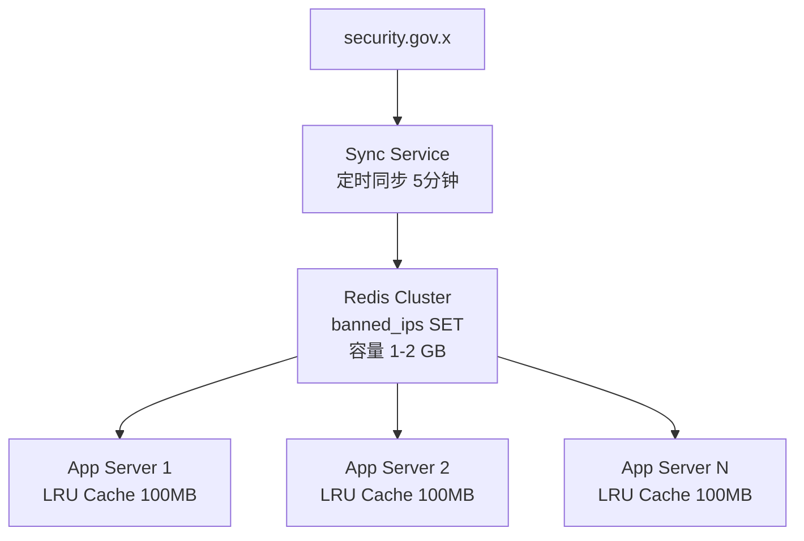
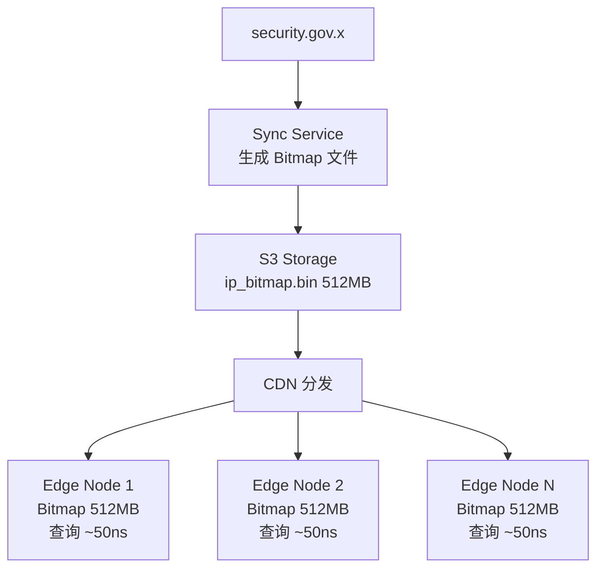
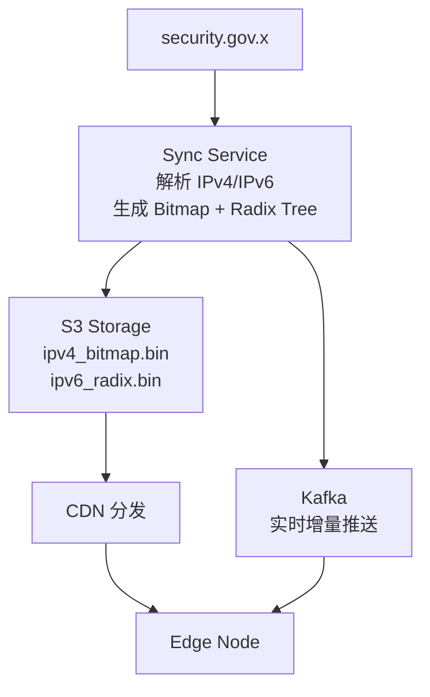
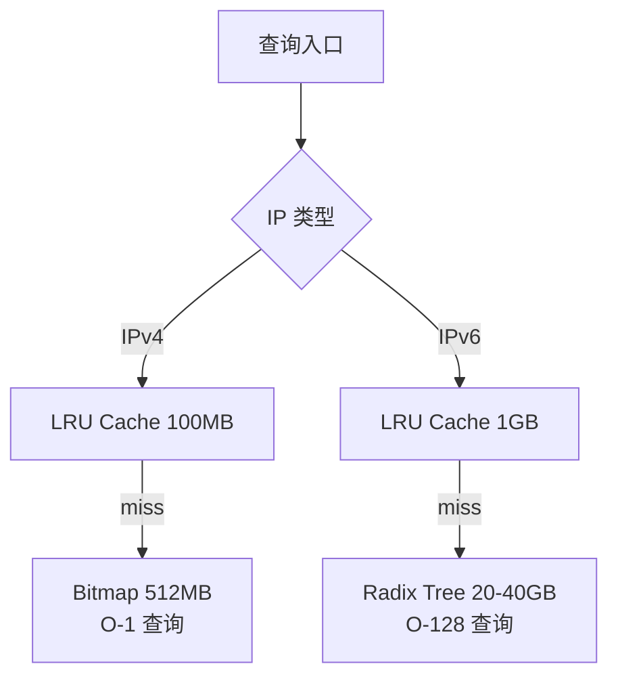

+++
title = "14.IP封禁系统设计 (IP Blocking System)"
date = 2026-01-29
description = "系统设计面试真题：大规模IP封禁系统完整设计，包含IPv4 Bitmap、IPv6 Radix Tree、多层缓存、实时同步、灰度上线"
[taxonomies]
tags = ["系统设计", "面试", "IP封禁", "Bitmap", "Radix Tree", "分布式"]
+++

# IP 封禁系统设计 (IP Blocking System)

> **面试频率**：⭐⭐⭐⭐（高频题）
> **难度**：中等偏难
> **考察重点**：数据结构选型、分布式缓存、实时同步、合规性设计

---

## 一、题目原文

> Imagine you're at a big internet company (like Twitter). Country X just passed a law that says we can't serve data to banned IP addresses (that is, if we receive a connection from a banned IP, we have to refuse). They expose an interface - `security.gov.x` - that tells us if an address is allowed or banned. The law goes into effect 2 months from now.
>
> You are in charge of dealing with this situation.

**翻译**：

假设你在一家大型互联网公司（如 Twitter）工作。X 国刚通过一项法律，规定我们不能向被封禁的 IP 地址提供服务（即如果收到来自被封禁 IP 的连接，必须拒绝）。政府开放了一个接口 `security.gov.x` 来查询某个 IP 是否被封禁。法律将在两个月后生效。

你负责处理这个情况。

---

## 二、面试应对策略

### 2.1 核心思路

这是一道开放性系统设计题，面试官考察的是：

1. **需求分析能力** —— 能否通过提问明确边界条件
2. **技术选型能力** —— 不同规模下的最优解
3. **工程落地能力** —— 如何在 2 个月内安全上线
4. **风险意识** —— 合规性、可用性、误封处理

### 2.2 回答框架

```
┌─────────────────────────────────────────────────────────────────┐
│                        回答框架 (45分钟)                         │
├─────────────────────────────────────────────────────────────────┤
│                                                                 │
│  1. 澄清问题 (5分钟)                                             │
│     └── 提问确认关键参数                                         │
│                                                                 │
│  2. 需求分析 (5分钟)                                             │
│     └── 功能需求 + 非功能需求                                    │
│                                                                 │
│  3. 高层设计 (10分钟)                                            │
│     └── 画架构图，解释核心组件                                    │
│                                                                 │
│  4. 深入设计 (15分钟)                                            │
│     └── 数据结构、同步策略、缓存设计                              │
│                                                                 │
│  5. 扩展讨论 (10分钟)                                            │
│     └── 上线方案、监控告警、边界情况                              │
│                                                                 │
└─────────────────────────────────────────────────────────────────┘
```

---

## 三、澄清问题（Clarifying Questions）

### 3.1 必问问题清单

在开始设计前，**必须**向面试官确认以下问题：

| 类别 | 问题 | 为什么重要 |
|------|------|-----------|
| **规模** | 封禁列表大概有多少 IP？1万？100万？10亿？ | 决定存储方案 |
| **类型** | 只有 IPv4 还是包含 IPv6？ | 数据结构完全不同 |
| **格式** | 是单个 IP 还是 CIDR 网段？ | 影响匹配算法 |
| **API** | 政府 API 支持批量查询还是逐个查询？ | 影响同步策略 |
| **时效** | 封禁生效需要多实时？秒级？分钟级？ | 影响架构复杂度 |
| **流量** | 系统当前 QPS 是多少？ | 影响缓存设计 |
| **容错** | 政府 API 挂了怎么办？ | 需要降级策略 |
| **白名单** | 是否有例外 IP（合作伙伴、CDN）？ | 白名单机制 |
| **历史数据** | 是否需要追溯之前的请求？ | 审计日志设计 |
| **多区域** | 是否有其他国家类似要求？ | 架构扩展性 |

### 3.2 典型场景假设

根据面试官的回答，会有以下几种典型场景：

```
┌──────────────────────────────────────────────────────────────────────────┐
│                           典型场景矩阵                                    │
├────────────┬─────────────┬─────────────┬─────────────┬──────────────────┤
│   场景     │  封禁数量    │   IP 类型   │  时效要求   │    推荐方案       │
├────────────┼─────────────┼─────────────┼─────────────┼──────────────────┤
│ 简单场景   │ < 100万     │ IPv4        │ 分钟级      │ Redis SET        │
├────────────┼─────────────┼─────────────┼─────────────┼──────────────────┤
│ 中等场景   │ 100万-1亿   │ IPv4        │ 分钟级      │ Bloom + Redis    │
├────────────┼─────────────┼─────────────┼─────────────┼──────────────────┤
│ 大规模     │ > 1亿       │ IPv4        │ 分钟级      │ Bitmap (512MB)   │
├────────────┼─────────────┼─────────────┼─────────────┼──────────────────┤
│ IPv6 场景  │ 任意        │ IPv6/混合   │ 分钟级      │ Radix Tree       │
├────────────┼─────────────┼─────────────┼─────────────┼──────────────────┤
│ 极端实时   │ 任意        │ 任意        │ 秒级        │ 推送 + 本地缓存   │
└────────────┴─────────────┴─────────────┴─────────────┴──────────────────┘
```

---

## 四、需求分析

### 4.1 功能需求 (Functional Requirements)

| 需求 | 描述 |
|------|------|
| IP 查询 | 判断任意 IP 是否在封禁列表中 |
| 列表同步 | 定期从 security.gov.x 同步封禁列表 |
| 实时更新 | 新增/解除封禁能及时生效 |
| 审计日志 | 记录每次封禁操作（合规要求） |

### 4.2 非功能需求 (Non-Functional Requirements)

| 需求 | 目标值 | 说明 |
|------|--------|------|
| **延迟** | P99 < 1ms | 不能影响正常请求 |
| **吞吐** | 支持 100万+ QPS | Twitter 级别 |
| **可用性** | 99.99% | 政府 API 挂了也要能工作 |
| **一致性** | 最终一致，延迟 < 5分钟 | 合规窗口期 |
| **准确性** | 零误封（false negative） | 宁可多封不可漏封 |

### 4.3 容量估算

假设 Twitter 规模：

```
日活用户: 5亿
每用户每天请求: 100次
日请求量: 500亿
QPS (峰值): 500亿 / 86400 × 3 ≈ 170万 QPS

封禁列表:
- 假设封禁 10亿 IPv4 (最坏情况)
- 存储: Bitmap 方案 = 512 MB
- 或: Redis SET = 40+ GB
```

---

## 五、方案设计

### 5.1 场景一：IPv4 小规模（< 1000万 IP）

**推荐方案**：Redis SET + 本地缓存



**查询流程**：

```
1. 请求到达 → 提取客户端 IP
2. 查询本地 LRU Cache
   - 命中 → 直接返回结果
   - 未命中 → 继续
3. 查询 Redis SISMEMBER
4. 结果写入 LRU Cache (TTL 5分钟)
5. 返回结果
```

**优点**：实现简单，维护成本低
**缺点**：Redis 成为瓶颈，不适合超大规模

---

### 5.2 场景二：IPv4 大规模（> 1亿 IP）

**推荐方案**：Bitmap 位图

**核心原理**：

```
IPv4 地址 = 32位无符号整数
范围: 0 ~ 4,294,967,295 (43亿)

Bitmap 表示:
┌───┬───┬───┬───┬───┬───┬───┬───┐
│ 0 │ 1 │ 0 │ 0 │ 1 │ 0 │ 1 │ 0 │  ← 1字节 = 8个IP
└───┴───┴───┴───┴───┴───┴───┴───┘
  ↑       ↑
  │       └── IP=4 被封禁
  └── IP=1 被封禁

总大小 = 2^32 / 8 = 512 MB (固定!)

无论封禁 1个 还是 43亿个 IP，存储都是 512 MB
```

**架构图**：



**查询算法**：

```
IP: 192.168.1.1
   │
   ▼
转换为整数: 3232235777
   │
   ▼
计算位置:
  - byte_index = 3232235777 / 8 = 404029472
  - bit_index  = 3232235777 % 8 = 1
   │
   ▼
读取 bitmap[byte_index] 的第 bit_index 位
   │
   ▼
1 = 封禁, 0 = 放行
```

**优点**：
- 存储固定 512MB，与 IP 数量无关
- 查询 O(1)，纳秒级延迟
- 无网络开销，本地内存操作

**缺点**：
- 不支持 IPv6
- 每个节点都需要 512MB 内存

---

### 5.3 场景三：IPv6 或混合场景

**推荐方案**：Radix Tree（基数树）

**为什么 Bitmap 不适用于 IPv6**：

| 对比 | IPv4 | IPv6 |
|------|------|------|
| 地址位数 | 32 位 | 128 位 |
| 地址空间 | 43 亿 | 3.4 × 10^38 |
| Bitmap 大小 | 512 MB | 无穷大 (不可行) |

**Radix Tree 原理**：

```
Radix Tree = 压缩的前缀树 (Trie)
相同前缀合并为一个节点，节省空间

示例: 封禁以下 IPv6
- 2001:db8::/32
- 2001:db8:85a3::/48
- 2607:f8b0::/32

                              ┌────────────────┐
                              │     Root       │
                              └───────┬────────┘
                                      │
              ┌───────────────────────┴───────────────────────┐
              │                                               │
              ▼                                               ▼
      ┌──────────────┐                                ┌──────────────┐
      │ 2001::/16    │                                │ 2607::/16    │
      └──────┬───────┘                                └──────┬───────┘
             │                                               │
             ▼                                               ▼
      ┌──────────────┐                                ┌──────────────┐
      │ db8::/32     │                                │ f8b0::/32    │
      │   ★ 封禁     │                                │   ★ 封禁     │
      └──────┬───────┘                                └──────────────┘
             │
             ▼
      ┌──────────────┐
      │ 85a3::/48    │
      │   ★ 封禁     │
      └──────────────┘

★ = 封禁标记
查询时从根向下匹配，遇到封禁标记即返回 true
```

**完整架构**：



**Edge Node 内部结构**：



**性能对比**：

| 指标 | IPv4 Bitmap | IPv6 Radix Tree |
|------|-------------|-----------------|
| 存储 | 512 MB (固定) | 20-40 GB (取决于数据量) |
| 查询延迟 | ~50 ns | ~1-5 μs |
| 支持 CIDR | 需预处理 | 原生支持 |
| 动态更新 | 简单 (bit 翻转) | 复杂 (树操作) |

---

## 六、关键设计细节

### 6.1 同步策略

```
┌─────────────────────────────────────────────────────────────────┐
│                         同步策略                                 │
├─────────────────────────────────────────────────────────────────┤
│                                                                 │
│  全量同步 (Daily Full Sync)                                     │
│  ─────────────────────────                                      │
│  • 频率: 每天 1 次 (凌晨低峰期)                                  │
│  • 方式: 拉取完整封禁列表，重建数据结构                          │
│  • 目的: 纠正累积误差，保证最终一致                              │
│                                                                 │
│  增量同步 (Incremental Sync)                                    │
│  ─────────────────────────                                      │
│  • 频率: 每 5 分钟                                               │
│  • 方式: 只拉取变化的 IP (新增封禁 + 解除封禁)                   │
│  • 目的: 快速响应政策变化                                        │
│                                                                 │
│  实时推送 (可选)                                                 │
│  ─────────────────────────                                      │
│  • 方式: 政府 API 支持 Webhook 回调                              │
│  • 延迟: 秒级生效                                                │
│  • 要求: 需政府 API 支持                                         │
│                                                                 │
└─────────────────────────────────────────────────────────────────┘
```

### 6.2 缓存 TTL 设计

```
┌─────────────────────────────────────────────────────────────────┐
│                      缓存 TTL 权衡                               │
├─────────────────────────────────────────────────────────────────┤
│                                                                 │
│   TTL 太短 (如 1秒)                                              │
│   ├── 优点: 封禁生效快                                          │
│   └── 缺点: 缓存命中率低，后端压力大                            │
│                                                                 │
│   TTL 太长 (如 1小时)                                            │
│   ├── 优点: 缓存命中率高，性能好                                │
│   └── 缺点: 解封延迟长，用户体验差                              │
│                                                                 │
│   推荐策略:                                                      │
│   ┌─────────────────────────────────────────────────────────┐   │
│   │  被封禁 IP 的缓存: TTL = 同步间隔 (5分钟)                │   │
│   │  正常 IP 的缓存:   TTL = 1-5 分钟                        │   │
│   │  热点 IP:          延长 TTL (LRU 自动管理)               │   │
│   └─────────────────────────────────────────────────────────┘   │
│                                                                 │
│   关键: 增量同步时主动清除相关缓存条目                           │
│                                                                 │
└─────────────────────────────────────────────────────────────────┘
```

### 6.3 热更新机制

```
┌─────────────────────────────────────────────────────────────────┐
│                      双缓冲热更新                                │
├─────────────────────────────────────────────────────────────────┤
│                                                                 │
│   问题: 如何在不停机情况下更新 512MB Bitmap?                     │
│                                                                 │
│   ┌─────────────┐         ┌─────────────┐                       │
│   │  Active     │◄────────│   指针      │◄──── 所有查询         │
│   │  Bitmap     │         │   切换      │                       │
│   │  (v1)       │         └──────┬──────┘                       │
│   └─────────────┘                │                              │
│                                  │ 原子切换                      │
│   ┌─────────────┐                │                              │
│   │  Standby    │◄───────────────┘                              │
│   │  Bitmap     │                                               │
│   │  (v2 加载中) │◄──── 后台加载新版本                            │
│   └─────────────┘                                               │
│                                                                 │
│   步骤:                                                          │
│   1. 后台下载新版本到 Standby 区                                 │
│   2. 验证完整性 (checksum)                                       │
│   3. 原子切换指针                                                │
│   4. 等待旧请求完成 (5秒 grace period)                           │
│   5. 释放旧版本内存                                              │
│                                                                 │
└─────────────────────────────────────────────────────────────────┘
```

### 6.4 降级策略

```
┌─────────────────────────────────────────────────────────────────┐
│                        降级策略                                  │
├─────────────────────────────────────────────────────────────────┤
│                                                                 │
│  场景1: 政府 API 不可用                                          │
│  ───────────────────────                                        │
│  • 触发: 连续 3 次同步失败                                       │
│  • 策略: 使用本地最新快照继续服务                                │
│  • 告警: P1 级别告警，通知 On-Call                               │
│  • 合规: 记录审计日志，说明使用缓存数据                          │
│                                                                 │
│  场景2: 边缘节点数据损坏                                         │
│  ───────────────────────                                        │
│  • 检测: checksum 校验失败                                       │
│  • 策略: 自动回滚到上一版本                                      │
│  • 告警: P2 级别告警                                             │
│                                                                 │
│  场景3: 大规模误封 (紧急回滚)                                    │
│  ───────────────────────                                        │
│  • 触发: 封禁率突然飙升 或 客诉激增                              │
│  • 策略: 一键关闭过滤，全部放行                                  │
│  • 权限: 需要 SRE 负责人审批                                     │
│                                                                 │
│  优先级决策:                                                     │
│  ┌─────────────────────────────────────────────────────────┐    │
│  │  合规模式 (默认): 不确定时拒绝请求                        │    │
│  │  可用性模式:      不确定时放行请求 (需审批)               │    │
│  └─────────────────────────────────────────────────────────┘    │
│                                                                 │
└─────────────────────────────────────────────────────────────────┘
```

---

## 七、上线方案（Go Live）

### 7.1 阶段规划

```
┌─────────────────────────────────────────────────────────────────┐
│                     8 周上线计划                                 │
├─────────────────────────────────────────────────────────────────┤
│                                                                 │
│  Week 1-2: 基础设施                                              │
│  ─────────────────────                                          │
│  • 对接政府 API，确认接口规格                                    │
│  • 搭建同步服务原型                                              │
│  • 确定数据结构 (Bitmap/Radix Tree)                              │
│                                                                 │
│  Week 3-4: 核心开发                                              │
│  ─────────────────────                                          │
│  • 实现同步服务 (全量 + 增量)                                    │
│  • 实现边缘节点过滤模块                                          │
│  • 单元测试 + 集成测试                                           │
│                                                                 │
│  Week 5: 暗上线 (Shadow Mode)                                    │
│  ─────────────────────                                          │
│  • 部署到生产环境                                                │
│  • 只记录日志，不实际封禁                                        │
│  • 验证命中率、误判率、延迟                                      │
│                                                                 │
│  Week 6: 灰度上线                                                │
│  ─────────────────────                                          │
│  • Day 1: 1% 流量开启封禁                                        │
│  • Day 2: 5% 流量                                                │
│  • Day 3: 20% 流量                                               │
│  • Day 4: 50% 流量                                               │
│  • 每阶段观察 24 小时                                            │
│                                                                 │
│  Week 7: 全量上线                                                │
│  ─────────────────────                                          │
│  • 100% 流量开启封禁                                             │
│  • 7×24 值班待命                                                 │
│  • 准备紧急回滚方案                                              │
│                                                                 │
│  Week 8: 缓冲期                                                  │
│  ─────────────────────                                          │
│  • 处理遗留问题                                                  │
│  • 性能调优                                                      │
│  • 文档完善                                                      │
│                                                                 │
└─────────────────────────────────────────────────────────────────┘
```

### 7.2 上线检查清单

| 项目 | 验收标准 | 负责人 |
|------|---------|--------|
| 同步正常 | 最近一次同步 < 10 分钟 | SRE |
| 覆盖率 | 所有边缘节点版本一致 | SRE |
| 延迟 | P99 < 1ms | 性能团队 |
| 误封率 | < 0.001% | QA |
| 审计日志 | 每条封禁有完整记录 | 合规团队 |
| 回滚能力 | 5 分钟内可关闭过滤 | SRE |
| 监控告警 | 核心指标告警覆盖 | SRE |
| 文档 | 运维手册、应急预案 | 研发 |

---

## 八、监控与告警

### 8.1 核心指标

```
┌─────────────────────────────────────────────────────────────────┐
│                        监控指标                                  │
├─────────────────────────────────────────────────────────────────┤
│                                                                 │
│  业务指标                                                        │
│  ─────────────────────                                          │
│  • ip_filter_requests_total     # 总请求数                      │
│  • ip_filter_blocked_total      # 被封禁数                      │
│  • ip_filter_blocked_rate       # 封禁率 (异常检测)             │
│                                                                 │
│  性能指标                                                        │
│  ─────────────────────                                          │
│  • ip_filter_latency_p50        # 查询延迟 P50                  │
│  • ip_filter_latency_p99        # 查询延迟 P99                  │
│  • ip_filter_cache_hit_rate     # 缓存命中率                    │
│                                                                 │
│  同步指标                                                        │
│  ─────────────────────                                          │
│  • sync_last_success_timestamp  # 最后成功同步时间              │
│  • sync_duration_seconds        # 同步耗时                      │
│  • sync_errors_total            # 同步失败次数                  │
│  • sync_ip_count                # 封禁 IP 总数                  │
│                                                                 │
│  一致性指标                                                      │
│  ─────────────────────                                          │
│  • edge_node_version_mismatch   # 版本不一致的节点数            │
│  • data_checksum_errors         # 数据校验失败                  │
│                                                                 │
└─────────────────────────────────────────────────────────────────┘
```

### 8.2 告警规则

| 告警 | 条件 | 级别 | 处理 |
|------|------|------|------|
| 同步失败 | 连续 3 次失败 | P1 | 立即处理 |
| 封禁率飙升 | > 2倍日常值 | P1 | 检查是否误封 |
| 延迟升高 | P99 > 10ms | P2 | 排查性能问题 |
| 版本不一致 | > 10% 节点 | P2 | 强制同步 |
| 缓存命中率下降 | < 80% | P3 | 调整缓存策略 |

---

## 九、边界情况与风险

### 9.1 技术风险

| 风险 | 影响 | 缓解措施 |
|------|------|---------|
| 政府 API 不稳定 | 无法同步最新数据 | 本地快照 + 指数退避重试 |
| 封禁列表暴增 | 内存不足 | Bitmap 固定大小，Radix Tree 分片 |
| 网络分区 | 部分节点数据过期 | 版本号校验 + 降级策略 |
| 时钟不同步 | 审计日志混乱 | 使用 NTP，日志带时区 |

### 9.2 业务风险

| 风险 | 影响 | 缓解措施 |
|------|------|---------|
| 误封正常用户 | 用户投诉、品牌受损 | 白名单机制 + 快速申诉通道 |
| 漏封违规 IP | 合规风险 | 宁可多封不可漏封 |
| 法律定义模糊 | 实施标准不清 | 法务确认，书面留档 |
| 多国法律冲突 | Country Y 禁止封禁 | 按地区隔离策略 |

### 9.3 特殊场景

```
┌─────────────────────────────────────────────────────────────────┐
│                      特殊场景处理                                │
├─────────────────────────────────────────────────────────────────┤
│                                                                 │
│  NAT/代理场景                                                    │
│  ─────────────────────                                          │
│  问题: 多用户共享同一出口 IP                                     │
│  影响: 封禁一个 IP 可能影响大量正常用户                          │
│  处理: 无解 (法律要求)，但可记录影响范围                         │
│                                                                 │
│  CDN/反向代理场景                                                │
│  ─────────────────────                                          │
│  问题: 请求经过 CDN，看不到真实 IP                               │
│  处理: 使用 X-Forwarded-For，注意伪造风险                        │
│                                                                 │
│  移动网络场景                                                    │
│  ─────────────────────                                          │
│  问题: 运营商 IP 池动态分配                                      │
│  影响: IP 解封后可能分配给其他用户                               │
│  处理: 依赖政府列表更新                                          │
│                                                                 │
│  内部流量场景                                                    │
│  ─────────────────────                                          │
│  问题: 内部服务调用也会被过滤                                    │
│  处理: 内部 IP 段加入白名单                                      │
│                                                                 │
│  VPN/Tor 出口节点                                                │
│  ─────────────────────                                          │
│  问题: 用户使用 VPN/Tor 绕过封禁                                 │
│  处理: 维护已知 VPN/Tor 出口 IP 列表，可选封禁                   │
│  注意: 可能误封正常 VPN 用户                                     │
│                                                                 │
│  云服务商 IP (AWS/GCP/Azure)                                     │
│  ─────────────────────                                          │
│  问题: 攻击者使用云服务器，IP 频繁更换                           │
│  处理: 依赖政府列表更新，可考虑额外的行为分析                    │
│                                                                 │
│  双栈网络 (Dual-Stack)                                           │
│  ─────────────────────                                          │
│  问题: 同一用户可能同时有 IPv4 和 IPv6 地址                      │
│  处理: 两个地址都需要检查，任一封禁即拒绝                        │
│  注意: IPv4-mapped IPv6 (::ffff:1.2.3.4) 需特殊处理              │
│                                                                 │
│  Anycast 场景                                                    │
│  ─────────────────────                                          │
│  问题: 用户可能被路由到不同的边缘节点                            │
│  处理: 确保所有节点数据同步，版本一致                            │
│                                                                 │
│  IP 欺骗 (Spoofing)                                              │
│  ─────────────────────                                          │
│  问题: 攻击者伪造源 IP                                           │
│  处理: TCP 握手天然防护，UDP 需额外验证                          │
│                                                                 │
└─────────────────────────────────────────────────────────────────┘
```

---

## 十、补充设计要点

### 10.1 过滤层级选择

```
┌─────────────────────────────────────────────────────────────────┐
│                     过滤层级对比                                 │
├─────────────────────────────────────────────────────────────────┤
│                                                                 │
│  Layer 3/4 (网络层/传输层)                                       │
│  ─────────────────────────                                      │
│  位置: 防火墙、负载均衡器、eBPF/XDP                              │
│  优点: 延迟极低 (<1μs)，CPU 开销小                               │
│  缺点: 无法获取 HTTP 头信息                                      │
│  适用: 大规模封禁，性能敏感场景                                  │
│                                                                 │
│  Layer 7 (应用层)                                                │
│  ─────────────────────────                                      │
│  位置: Nginx、应用代码                                           │
│  优点: 可获取 X-Forwarded-For、灵活定制响应                      │
│  缺点: 延迟较高，资源消耗大                                      │
│  适用: 需要识别真实 IP (CDN 后)                                  │
│                                                                 │
│  推荐: 双层过滤                                                  │
│  ┌─────────────────────────────────────────────────────────┐    │
│  │  L3/4: 快速过滤已知封禁 IP (eBPF/iptables)              │    │
│  │  L7:   处理 CDN 场景，精确判断真实 IP                   │    │
│  └─────────────────────────────────────────────────────────┘    │
│                                                                 │
└─────────────────────────────────────────────────────────────────┘
```

### 10.2 eBPF/XDP 高性能过滤（加分项）

```
┌─────────────────────────────────────────────────────────────────┐
│                   eBPF/XDP 方案 (极致性能)                       │
├─────────────────────────────────────────────────────────────────┤
│                                                                 │
│  传统路径:                                                       │
│  ┌───────┐   ┌───────┐   ┌───────┐   ┌───────┐   ┌───────┐     │
│  │ NIC   │──▶│ 内核  │──▶│ TCP   │──▶│ App   │──▶│ 判断  │     │
│  │       │   │ 协议栈 │   │ 握手  │   │ 处理  │   │ 封禁  │     │
│  └───────┘   └───────┘   └───────┘   └───────┘   └───────┘     │
│                                                                 │
│  XDP 路径:                                                       │
│  ┌───────┐   ┌───────┐                                          │
│  │ NIC   │──▶│ XDP   │──▶ DROP (封禁) 或 PASS (放行)            │
│  │       │   │ 程序  │   在网卡驱动层直接处理，无需进入内核      │
│  └───────┘   └───────┘                                          │
│                                                                 │
│  性能对比:                                                       │
│  ┌──────────────────┬────────────────┬────────────────┐         │
│  │ 方案             │ 延迟           │ 吞吐           │         │
│  ├──────────────────┼────────────────┼────────────────┤         │
│  │ 应用层过滤       │ ~100 μs        │ 100K pps       │         │
│  │ iptables         │ ~10 μs         │ 1M pps         │         │
│  │ eBPF/XDP         │ ~1 μs          │ 10M+ pps       │         │
│  └──────────────────┴────────────────┴────────────────┘         │
│                                                                 │
│  限制: XDP 不支持读取 HTTP 头，无法处理 CDN 场景                 │
│                                                                 │
└─────────────────────────────────────────────────────────────────┘
```

### 10.3 Bloom Filter 方案（中等规模）

```
┌─────────────────────────────────────────────────────────────────┐
│               Bloom Filter 方案 (100万-1亿 IP)                   │
├─────────────────────────────────────────────────────────────────┤
│                                                                 │
│  原理: 概率数据结构，允许假阳性，不允许假阴性                    │
│                                                                 │
│  查询流程:                                                       │
│  ┌─────────────────────────────────────────────────────────┐    │
│  │                                                         │    │
│  │   IP ──▶ Bloom Filter ──┬── 不存在 ──▶ 放行 (100%确定)  │    │
│  │                         │                               │    │
│  │                         └── 可能存在 ──▶ 查询 Redis     │    │
│  │                                              │          │    │
│  │                                    ┌─────────┴─────────┐│    │
│  │                                    ▼                   ▼│    │
│  │                                  存在               不存在│    │
│  │                                  封禁              放行  │    │
│  │                               (真阳性)           (假阳性)│    │
│  └─────────────────────────────────────────────────────────┘    │
│                                                                 │
│  参数设计 (1亿 IP, 1% 假阳性率):                                 │
│  ┌──────────────────────────────────────────────────────────┐   │
│  │  Bloom Filter 大小: ~120 MB                              │   │
│  │  Hash 函数数量: 7                                        │   │
│  │  99% 请求在 Bloom Filter 层结束 (正常 IP 直接放行)       │   │
│  │  1% 假阳性需要查询 Redis 确认                            │   │
│  └──────────────────────────────────────────────────────────┘   │
│                                                                 │
│  优点: 内存占用小，查询快                                        │
│  缺点: 不支持删除 (解封需要重建)，有假阳性                       │
│                                                                 │
└─────────────────────────────────────────────────────────────────┘
```

### 10.4 CIDR 聚合优化

```
┌─────────────────────────────────────────────────────────────────┐
│                      CIDR 聚合策略                               │
├─────────────────────────────────────────────────────────────────┤
│                                                                 │
│  问题: 政府可能下发大量连续 IP，逐个存储浪费空间                 │
│                                                                 │
│  示例:                                                           │
│  ┌─────────────────────────────────────────────────────────┐    │
│  │  原始: 192.168.1.0, 192.168.1.1, ... 192.168.1.255      │    │
│  │  聚合后: 192.168.1.0/24 (一条规则代替 256 条)            │    │
│  └─────────────────────────────────────────────────────────┘    │
│                                                                 │
│  实现方式:                                                       │
│  • IPv4 Bitmap: 无需聚合，天然支持任意规模                       │
│  • IPv6 Radix Tree: 天然支持 CIDR 前缀匹配                       │
│  • Redis SET: 需要预处理聚合，或使用 Sorted Set 范围查询         │
│                                                                 │
│  聚合算法:                                                       │
│  1. 将所有 IP 转换为整数并排序                                   │
│  2. 识别连续区间                                                 │
│  3. 合并为最大 CIDR 块                                           │
│  4. 使用 Patricia Trie 存储和查询                                │
│                                                                 │
└─────────────────────────────────────────────────────────────────┘
```

### 10.5 长连接与 WebSocket 处理

```
┌─────────────────────────────────────────────────────────────────┐
│                   长连接场景处理                                 │
├─────────────────────────────────────────────────────────────────┤
│                                                                 │
│  问题: 用户已建立连接后被封禁，如何处理？                        │
│                                                                 │
│  方案 1: 连接时检查 (推荐)                                       │
│  ─────────────────────────                                      │
│  • 只在连接建立时检查 IP                                         │
│  • 已建立连接不受新封禁影响                                      │
│  • 优点: 实现简单，用户体验好                                    │
│  • 缺点: 存在合规窗口期                                          │
│                                                                 │
│  方案 2: 定期重检                                                │
│  ─────────────────────────                                      │
│  • 每 N 分钟重新检查活跃连接的 IP                                │
│  • 发现封禁后主动断开连接                                        │
│  • 优点: 合规性更好                                              │
│  • 缺点: 增加系统复杂度                                          │
│                                                                 │
│  方案 3: 事件驱动                                                │
│  ─────────────────────────                                      │
│  • 封禁列表更新时，推送到连接管理器                              │
│  • 连接管理器主动断开匹配的连接                                  │
│  • 优点: 实时性最好                                              │
│  • 缺点: 架构复杂                                                │
│                                                                 │
│  推荐: 方案 1 + 定期全量重检 (每小时)                            │
│                                                                 │
└─────────────────────────────────────────────────────────────────┘
```

### 10.6 真实 IP 获取策略

```
┌─────────────────────────────────────────────────────────────────┐
│                   真实 IP 识别                                   │
├─────────────────────────────────────────────────────────────────┤
│                                                                 │
│  场景: 请求经过 CDN/LB/代理，直连 IP 是代理服务器                │
│                                                                 │
│  请求链路:                                                       │
│  User (1.2.3.4) ──▶ CDN (5.6.7.8) ──▶ LB (10.0.0.1) ──▶ App    │
│                                                                 │
│  获取真实 IP 的方式:                                             │
│  ┌─────────────────────────────────────────────────────────┐    │
│  │  Header              │ 示例值                           │    │
│  ├──────────────────────┼──────────────────────────────────┤    │
│  │  X-Forwarded-For     │ 1.2.3.4, 5.6.7.8                 │    │
│  │  X-Real-IP           │ 1.2.3.4                          │    │
│  │  CF-Connecting-IP    │ 1.2.3.4 (Cloudflare 专用)        │    │
│  │  True-Client-IP      │ 1.2.3.4 (Akamai 专用)            │    │
│  └─────────────────────────────────────────────────────────┘    │
│                                                                 │
│  安全风险: X-Forwarded-For 可被伪造!                             │
│                                                                 │
│  防护策略:                                                       │
│  ┌─────────────────────────────────────────────────────────┐    │
│  │  1. 只信任已知代理 IP 设置的头                           │    │
│  │  2. 配置可信代理列表 (CDN IP 段)                         │    │
│  │  3. 从右向左解析 X-Forwarded-For，取第一个非可信 IP      │    │
│  │  4. 对于可疑请求，同时封禁直连 IP 和声称的真实 IP        │    │
│  └─────────────────────────────────────────────────────────┘    │
│                                                                 │
└─────────────────────────────────────────────────────────────────┘
```

### 10.7 错误响应设计

```
┌─────────────────────────────────────────────────────────────────┐
│                   封禁响应设计                                   │
├─────────────────────────────────────────────────────────────────┤
│                                                                 │
│  HTTP 状态码选择:                                                │
│  ┌──────────────────────────────────────────────────────────┐   │
│  │  403 Forbidden      - 最常用，明确表示拒绝访问           │   │
│  │  451 Unavailable    - 因法律原因不可用 (RFC 7725)        │   │
│  │       For Legal                                          │   │
│  │       Reasons       - 推荐用于政府合规场景               │   │
│  └──────────────────────────────────────────────────────────┘   │
│                                                                 │
│  响应内容 (需法务审核):                                          │
│  ┌──────────────────────────────────────────────────────────┐   │
│  │  {                                                       │   │
│  │    "error": "access_denied",                             │   │
│  │    "message": "Access to this service is not available   │   │
│  │                in your region.",                         │   │
│  │    "support": "support@company.com"                      │   │
│  │  }                                                       │   │
│  └──────────────────────────────────────────────────────────┘   │
│                                                                 │
│  注意事项:                                                       │
│  • 不要透露具体封禁原因 (避免泄露策略)                           │
│  • 不要显示用户 IP (隐私保护)                                    │
│  • 提供客服联系方式 (处理误封)                                   │
│  • 响应内容需多语言支持                                          │
│                                                                 │
└─────────────────────────────────────────────────────────────────┘
```

### 10.8 政府 API 对接细节

```
┌─────────────────────────────────────────────────────────────────┐
│                   政府 API 对接考量                              │
├─────────────────────────────────────────────────────────────────┤
│                                                                 │
│  需确认的接口规格:                                               │
│  ┌──────────────────────────────────────────────────────────┐   │
│  │  问题                      │ 影响                        │   │
│  ├────────────────────────────┼─────────────────────────────┤   │
│  │  认证方式 (API Key/mTLS)   │ 安全架构设计                │   │
│  │  速率限制                  │ 同步策略设计                │   │
│  │  数据格式 (JSON/Protobuf)  │ 解析逻辑                    │   │
│  │  分页方式                  │ 全量同步实现                │   │
│  │  增量接口 (有/无)          │ 同步效率                    │   │
│  │  SLA 保证                  │ 降级策略设计                │   │
│  │  变更通知 (推送/轮询)      │ 实时性                      │   │
│  │  测试环境                  │ 开发调试                    │   │
│  └──────────────────────────────────────────────────────────┘   │
│                                                                 │
│  安全要求:                                                       │
│  • 使用 mTLS 双向认证                                            │
│  • API 密钥定期轮换                                              │
│  • 传输加密 (TLS 1.3)                                            │
│  • 审计所有 API 调用                                             │
│                                                                 │
│  容错设计:                                                       │
│  • 指数退避重试                                                  │
│  • 熔断器模式 (连续失败后暂停调用)                               │
│  • 备用 API 端点                                                 │
│  • 离线模式 (使用本地缓存)                                       │
│                                                                 │
└─────────────────────────────────────────────────────────────────┘
```

### 10.9 数据隐私合规 (GDPR)

```
┌─────────────────────────────────────────────────────────────────┐
│                   数据隐私考量                                   │
├─────────────────────────────────────────────────────────────────┤
│                                                                 │
│  IP 地址是否属于个人数据?                                        │
│  ───────────────────────                                        │
│  • GDPR 观点: 是 (可关联到个人)                                  │
│  • 影响: 存储和处理需要合法依据                                  │
│                                                                 │
│  合规措施:                                                       │
│  ┌──────────────────────────────────────────────────────────┐   │
│  │  1. 法律依据: "合法利益" 或 "法律义务"                   │   │
│  │  2. 数据最小化: 只存储必要信息                           │   │
│  │  3. 保留期限: 明确日志保留时间                           │   │
│  │  4. 访问控制: 限制谁能访问封禁列表                       │   │
│  │  5. 审计追踪: 记录谁访问了数据                           │   │
│  └──────────────────────────────────────────────────────────┘   │
│                                                                 │
│  审计日志保留:                                                   │
│  • 封禁记录: 按法规要求 (通常 2-7 年)                            │
│  • 访问日志: 90 天 (性能考虑)                                    │
│  • 需要与法务确认具体要求                                        │
│                                                                 │
└─────────────────────────────────────────────────────────────────┘
```

### 10.10 容量规划与扩展

```
┌─────────────────────────────────────────────────────────────────┐
│                      容量规划                                    │
├─────────────────────────────────────────────────────────────────┤
│                                                                 │
│  当前容量 vs 未来增长                                            │
│  ─────────────────────────                                      │
│  • 封禁 IP 数量: 当前 1亿 → 未来 10亿 (Bitmap 无影响)            │
│  • QPS: 当前 100万 → 未来 1000万 (需增加边缘节点)                │
│  • 边缘节点: 当前 50 → 未来 200 (CDN 成本线性增长)               │
│                                                                 │
│  扩展策略                                                        │
│  ─────────────────────────                                      │
│  ┌──────────────────────────────────────────────────────────┐   │
│  │  维度           │ 扩展方式                               │   │
│  ├──────────────────┼───────────────────────────────────────┤   │
│  │  QPS            │ 增加边缘节点 (水平扩展)                │   │
│  │  IPv4 数量      │ Bitmap 固定 512MB，无需扩展            │   │
│  │  IPv6 数量      │ Radix Tree 分片，按前缀分区            │   │
│  │  同步频率       │ 增加同步服务实例，分区并行             │   │
│  │  存储           │ S3 自动扩展，增加版本保留              │   │
│  └──────────────────────────────────────────────────────────┘   │
│                                                                 │
│  瓶颈分析                                                        │
│  ─────────────────────────                                      │
│  • 政府 API 速率限制 → 多账号/IP 轮询                            │
│  • CDN 带宽 → 增量同步减少传输量                                 │
│  • 边缘节点内存 → IPv6 Radix Tree 分片                           │
│                                                                 │
└─────────────────────────────────────────────────────────────────┘
```

### 10.11 数据主权与地理隔离

```
┌─────────────────────────────────────────────────────────────────┐
│                   数据主权考量                                   │
├─────────────────────────────────────────────────────────────────┤
│                                                                 │
│  场景: 多个国家有类似封禁要求                                    │
│                                                                 │
│  架构设计:                                                       │
│  ┌─────────────────────────────────────────────────────────┐    │
│  │                                                         │    │
│  │   Country X          Country Y          Country Z       │    │
│  │   ┌─────────┐        ┌─────────┐        ┌─────────┐     │    │
│  │   │ Gov API │        │ Gov API │        │ Gov API │     │    │
│  │   └────┬────┘        └────┬────┘        └────┬────┘     │    │
│  │        │                  │                  │          │    │
│  │        ▼                  ▼                  ▼          │    │
│  │   ┌─────────┐        ┌─────────┐        ┌─────────┐     │    │
│  │   │ Sync X  │        │ Sync Y  │        │ Sync Z  │     │    │
│  │   └────┬────┘        └────┬────┘        └────┬────┘     │    │
│  │        │                  │                  │          │    │
│  │        ▼                  ▼                  ▼          │    │
│  │   ┌─────────┐        ┌─────────┐        ┌─────────┐     │    │
│  │   │Bitmap X │        │Bitmap Y │        │Bitmap Z │     │    │
│  │   └─────────┘        └─────────┘        └─────────┘     │    │
│  │                                                         │    │
│  │   用户请求 → 根据地理位置路由 → 应用对应国家的封禁规则  │    │
│  │                                                         │    │
│  └─────────────────────────────────────────────────────────┘    │
│                                                                 │
│  关键原则:                                                       │
│  • 封禁列表按国家隔离存储                                        │
│  • 边缘节点只加载服务区域的规则                                  │
│  • 审计日志按国家分区存储                                        │
│  • 避免跨境数据传输 (GDPR/数据本地化)                            │
│                                                                 │
│  冲突处理:                                                       │
│  • Country X 要求封禁，Country Y 要求不能封禁                    │
│  • 解决: 按用户所在地区应用规则，而非服务器所在地区              │
│  • 法务确认: 书面记录决策依据                                    │
│                                                                 │
└─────────────────────────────────────────────────────────────────┘
```

### 10.12 安全加固

```
┌─────────────────────────────────────────────────────────────────┐
│                      安全考量                                    │
├─────────────────────────────────────────────────────────────────┤
│                                                                 │
│  封禁列表保护                                                    │
│  ─────────────────────────                                      │
│  • 威胁: 封禁列表泄露可能被利用 (攻击者知道哪些 IP 被监控)       │
│  • 措施:                                                         │
│    - 传输加密 (TLS 1.3)                                          │
│    - 存储加密 (S3 SSE-S3 或 SSE-KMS)                             │
│    - 访问控制 (IAM 最小权限)                                     │
│    - 审计日志 (谁访问了封禁列表)                                 │
│                                                                 │
│  API 安全                                                        │
│  ─────────────────────────                                      │
│  • 政府 API 认证: mTLS 双向认证                                  │
│  • 内部 API: JWT + RBAC                                          │
│  • 密钥管理: HashiCorp Vault 或 AWS Secrets Manager              │
│  • 密钥轮换: 每 90 天自动轮换                                    │
│                                                                 │
│  防篡改                                                          │
│  ─────────────────────────                                      │
│  • Bitmap 文件签名: SHA-256 + 数字签名                           │
│  • 边缘节点验证签名后才加载                                      │
│  • 签名密钥与数据分离存储                                        │
│                                                                 │
│  DDoS 防护                                                       │
│  ─────────────────────────                                      │
│  • IP 过滤与 DDoS 防护解耦                                       │
│  • eBPF 在内核层过滤，不消耗应用层资源                           │
│  • 速率限制在 IP 过滤之前                                        │
│                                                                 │
└─────────────────────────────────────────────────────────────────┘
```

### 10.13 测试策略

```
┌─────────────────────────────────────────────────────────────────┐
│                      测试策略                                    │
├─────────────────────────────────────────────────────────────────┤
│                                                                 │
│  单元测试                                                        │
│  ─────────────────────                                          │
│  • Bitmap 位操作正确性                                           │
│  • IP 解析和转换                                                 │
│  • CIDR 匹配逻辑                                                 │
│  • 缓存 TTL 过期                                                 │
│                                                                 │
│  集成测试                                                        │
│  ─────────────────────                                          │
│  • 同步服务与 Mock 政府 API                                      │
│  • 边缘节点数据更新                                              │
│  • 多节点一致性                                                  │
│                                                                 │
│  性能测试                                                        │
│  ─────────────────────                                          │
│  • 查询延迟 (目标: P99 < 1ms)                                    │
│  • 吞吐量 (目标: 100万+ QPS)                                     │
│  • 同步耗时 (10亿 IP 全量同步)                                   │
│                                                                 │
│  混沌测试                                                        │
│  ─────────────────────                                          │
│  • 政府 API 不可用                                               │
│  • Redis 宕机                                                    │
│  • 网络分区                                                      │
│  • 数据损坏                                                      │
│                                                                 │
│  影子测试 (Shadow Testing)                                       │
│  ─────────────────────                                          │
│  • 复制生产流量到测试环境                                        │
│  • 对比过滤结果，验证准确性                                      │
│  • 不影响真实用户                                                │
│                                                                 │
│  回归测试                                                        │
│  ─────────────────────                                          │
│  • 已知封禁 IP 列表验证                                          │
│  • 边界 IP 测试 (0.0.0.0, 255.255.255.255)                       │
│  • IPv4-mapped IPv6 地址 (::ffff:192.168.1.1)                    │
│                                                                 │
│  边界用例完整清单                                                 │
│  ─────────────────────                                          │
│  • 空封禁列表                                                    │
│  • 全量封禁 (43亿 IPv4 全封)                                     │
│  • 单 IP 封禁/解封循环                                           │
│  • CIDR /0 (全网段)                                              │
│  • CIDR /32 (单 IP)                                              │
│  • 重叠 CIDR (10.0.0.0/8 和 10.1.0.0/16)                         │
│  • 私有 IP 段 (10.x, 172.16.x, 192.168.x)                        │
│  • 环回地址 (127.0.0.1, ::1)                                     │
│  • 多播地址 (224.0.0.0/4)                                        │
│  • 链路本地地址 (169.254.x.x, fe80::)                            │
│                                                                 │
└─────────────────────────────────────────────────────────────────┘
```

---

## 十一、面试加分点

### 11.1 主动提及的亮点

1. **合规意识**：主动提到审计日志、法务确认、责任边界
2. **灰度上线**：不是一刀切，而是渐进式上线
3. **降级策略**：考虑各种故障场景
4. **成本意识**：Bitmap 方案比 Redis 省钱省资源
5. **IPv6 前瞻**：主动考虑 IPv6 场景

### 11.2 如果时间允许，可以讨论

- **分布式一致性**：如何保证全球节点数据一致
- **安全性**：防止封禁列表泄露
- **性能优化**：SIMD 指令加速 Bitmap 查询
- **容量规划**：流量增长后的扩展方案

### 11.3 常见追问

| 问题 | 回答要点 |
|------|---------|
| 如何保证零漏封？ | 宁可误封不可漏封 + 多层校验 + Bitmap 无假阴性 |
| 延迟要求更高怎么办？ | eBPF/XDP + 边缘节点本地化 + 内存数据结构 |
| 封禁列表是机密的怎么办？ | mTLS + 端到端加密 + 访问审计 + 最小权限原则 |
| 如何测试？ | 影子模式 + 回放历史流量 + 混沌测试 |
| 多个国家都有类似要求？ | 分区域独立封禁列表 + 统一框架 + 按地理位置路由 |
| 封禁列表突然增加 10 倍？ | Bitmap 固定 512MB 无影响；Radix Tree 需要分片 |
| 如何处理误封投诉？ | 快速申诉通道 + 白名单临时放行 + 审计追溯 |
| CDN 后面看不到真实 IP？ | X-Forwarded-For + 可信代理列表 + 从右向左解析 |
| 长连接用户被封禁？ | 定期重检 + 主动断开 + 优雅关闭 |
| 如何防止 DDoS 攻击？ | eBPF 前置过滤 + 速率限制 + 与封禁解耦 |

### 11.4 成本估算

```
┌─────────────────────────────────────────────────────────────────┐
│                      成本估算 (月度)                             │
├─────────────────────────────────────────────────────────────────┤
│                                                                 │
│  方案 A: Redis SET (小规模)                                      │
│  ─────────────────────────                                      │
│  • Redis Cluster (3主3从): ~$2,000/月                           │
│  • 同步服务 (2 实例): ~$200/月                                   │
│  • 总计: ~$2,200/月                                              │
│                                                                 │
│  方案 B: Bitmap (大规模 IPv4)                                    │
│  ─────────────────────────                                      │
│  • S3 存储 (512MB × 版本): ~$10/月                               │
│  • CDN 分发: ~$500/月                                            │
│  • 同步服务: ~$200/月                                            │
│  • 边缘节点额外内存 (+512MB × N): 已有成本                       │
│  • 总计: ~$710/月                                                │
│                                                                 │
│  方案 C: Radix Tree (IPv6)                                       │
│  ─────────────────────────                                      │
│  • S3 存储 (40GB × 版本): ~$100/月                               │
│  • CDN 分发: ~$2,000/月                                          │
│  • 边缘节点额外内存 (+40GB × N): ~$5,000/月                      │
│  • 总计: ~$7,100/月                                              │
│                                                                 │
│  隐性成本:                                                       │
│  • 开发人力: 2-3 人 × 2 月 = ~$80,000 (一次性)                   │
│  • 运维人力: 0.5 FTE = ~$5,000/月                                │
│  • 合规审计: ~$10,000/年                                         │
│                                                                 │
└─────────────────────────────────────────────────────────────────┘
```

### 11.5 SLI/SLO 定义

```
┌─────────────────────────────────────────────────────────────────┐
│                      SLI/SLO 定义                                │
├─────────────────────────────────────────────────────────────────┤
│                                                                 │
│  可用性 SLO                                                      │
│  ─────────────────────────                                      │
│  • SLI: 成功处理的请求数 / 总请求数                              │
│  • SLO: 99.99% (每月最多 4.3 分钟不可用)                         │
│  • 错误预算: 0.01% 请求可失败                                    │
│                                                                 │
│  延迟 SLO                                                        │
│  ─────────────────────────                                      │
│  • SLI: IP 检查延迟                                              │
│  • SLO: P50 < 100μs, P99 < 1ms, P99.9 < 10ms                    │
│                                                                 │
│  数据新鲜度 SLO                                                  │
│  ─────────────────────────                                      │
│  • SLI: 最后成功同步时间                                         │
│  • SLO: 同步延迟 < 10 分钟 (99.9%)                               │
│  • 全量同步: 每 24 小时至少 1 次                                 │
│                                                                 │
│  准确性 SLO                                                      │
│  ─────────────────────────                                      │
│  • 假阴性率 (漏封): 0% (硬性要求)                                │
│  • 假阳性率 (误封): < 0.001%                                     │
│                                                                 │
│  一致性 SLO                                                      │
│  ─────────────────────────                                      │
│  • SLI: 版本一致的边缘节点比例                                   │
│  • SLO: > 99% 节点版本一致                                       │
│                                                                 │
└─────────────────────────────────────────────────────────────────┘
```

### 11.6 运维手册要点

```
┌─────────────────────────────────────────────────────────────────┐
│                      Runbook 核心场景                            │
├─────────────────────────────────────────────────────────────────┤
│                                                                 │
│  场景 1: 同步失败告警                                            │
│  ─────────────────────────                                      │
│  1. 检查政府 API 状态 (curl https://security.gov.x/health)       │
│  2. 检查同步服务日志 (kubectl logs sync-service-xxx)            │
│  3. 检查网络连通性 (是否被防火墙拦截)                            │
│  4. 若 API 不可用，确认使用本地快照继续服务                      │
│  5. 通知法务团队，记录事件                                       │
│  6. 升级: 30 分钟未恢复 → P1 On-Call                             │
│                                                                 │
│  场景 2: 封禁率异常飙升                                          │
│  ─────────────────────────                                      │
│  1. 检查最近同步内容 (是否有大批量新增)                          │
│  2. 对比前后版本 diff (多了哪些 IP/CIDR)                         │
│  3. 抽样检查被封禁请求 (是否有误封迹象)                          │
│  4. 若确认误封:                                                  │
│     a. 回滚到上一版本                                            │
│     b. 或: 启用紧急开关，暂停过滤                                │
│  5. 通知产品/法务，评估影响                                      │
│                                                                 │
│  场景 3: 边缘节点版本不一致                                      │
│  ─────────────────────────                                      │
│  1. 识别不一致节点 (监控面板)                                    │
│  2. 检查节点网络/CDN 拉取状态                                    │
│  3. 手动触发同步: curl -X POST /admin/sync                       │
│  4. 若持续失败，隔离节点 (从 LB 摘除)                            │
│  5. 修复后重新上线                                               │
│                                                                 │
│  场景 4: 紧急全量放行                                            │
│  ─────────────────────────                                      │
│  触发条件: 大规模误封，业务严重受损                              │
│  操作: kubectl set env deployment/edge-filter FILTER_ENABLED=false│
│  审批: 需 SRE 负责人 + 法务确认                                  │
│  恢复: 修复后重新启用，逐步灰度                                  │
│                                                                 │
└─────────────────────────────────────────────────────────────────┘
```

### 11.7 Feature Flags 设计

```
┌─────────────────────────────────────────────────────────────────┐
│                      Feature Flags                               │
├─────────────────────────────────────────────────────────────────┤
│                                                                 │
│  ip_filter.enabled                                               │
│  ─────────────────────────                                      │
│  • 描述: 总开关，控制是否启用 IP 过滤                            │
│  • 默认: true (生产), false (开发)                               │
│  • 用途: 紧急回滚                                                │
│                                                                 │
│  ip_filter.mode                                                  │
│  ─────────────────────────                                      │
│  • 值: "enforce" | "shadow" | "log_only"                        │
│  • enforce: 真实封禁                                             │
│  • shadow: 记录日志但不封禁                                      │
│  • log_only: 只记录匹配，不执行任何动作                          │
│                                                                 │
│  ip_filter.rollout_percentage                                    │
│  ─────────────────────────                                      │
│  • 描述: 灰度比例 (0-100)                                        │
│  • 用途: 渐进式上线                                              │
│  • 实现: hash(request_id) % 100 < percentage                    │
│                                                                 │
│  ip_filter.whitelist_enabled                                     │
│  ─────────────────────────                                      │
│  • 描述: 是否启用白名单                                          │
│  • 用途: 豁免特定 IP (合作伙伴、内部服务)                        │
│                                                                 │
│  ip_filter.fail_mode                                             │
│  ─────────────────────────                                      │
│  • 值: "open" | "closed"                                        │
│  • open: 出错时放行 (可用性优先)                                 │
│  • closed: 出错时封禁 (合规优先, 默认)                           │
│                                                                 │
└─────────────────────────────────────────────────────────────────┘
```

### 11.8 团队与职责

```
┌─────────────────────────────────────────────────────────────────┐
│                      团队职责矩阵                                │
├─────────────────────────────────────────────────────────────────┤
│                                                                 │
│  角色              │ 职责                                        │
│  ─────────────────────────────────────────────────────────────  │
│  Tech Lead         │ 架构设计、技术决策、代码审查                │
│  Backend Engineer  │ 同步服务开发、数据结构实现                  │
│  Infra Engineer    │ 边缘节点集成、eBPF 开发                     │
│  SRE               │ 部署、监控、On-Call、Runbook                │
│  QA                │ 测试策略、性能测试、混沌测试                │
│  Legal/Compliance  │ 合规确认、审计要求、责任边界                │
│  Product Manager   │ 需求对接、利益相关者沟通                    │
│                                                                 │
│  人力估算:                                                       │
│  ┌──────────────────────────────────────────────────────────┐   │
│  │  Phase 1-4 (开发): 2 Backend + 1 Infra + 0.5 SRE         │   │
│  │  Phase 5-7 (上线): 1 Backend + 1 SRE + 0.5 QA            │   │
│  │  Phase 8+ (维护): 0.5 SRE (日常运维)                     │   │
│  └──────────────────────────────────────────────────────────┘   │
│                                                                 │
└─────────────────────────────────────────────────────────────────┘
```

### 11.9 常见错误与反模式

```
┌─────────────────────────────────────────────────────────────────┐
│                   面试常见错误 (避坑指南)                        │
├─────────────────────────────────────────────────────────────────┤
│                                                                 │
│  ❌ 错误 1: 每次请求都调用政府 API                               │
│  ─────────────────────────                                      │
│  问题: 延迟高、成本高、单点故障                                  │
│  正解: 本地缓存/同步，批量拉取                                   │
│                                                                 │
│  ❌ 错误 2: 使用 HashSet 存储 10 亿 IP                           │
│  ─────────────────────────                                      │
│  问题: 内存占用 40+ GB，Redis 无法承受                           │
│  正解: Bitmap (512MB) 或 Bloom Filter                           │
│                                                                 │
│  ❌ 错误 3: IPv6 也用 Bitmap                                     │
│  ─────────────────────────                                      │
│  问题: 2^128 个地址，无法存储                                    │
│  正解: Radix Tree 或分层 HashMap                                │
│                                                                 │
│  ❌ 错误 4: 一次性全量上线                                       │
│  ─────────────────────────                                      │
│  问题: 无法验证正确性，出问题影响全量用户                        │
│  正解: 暗上线 → 灰度 → 全量                                     │
│                                                                 │
│  ❌ 错误 5: 忽略 X-Forwarded-For 伪造风险                        │
│  ─────────────────────────                                      │
│  问题: 攻击者可伪造 IP 绕过封禁                                  │
│  正解: 只信任可信代理，从右向左解析                              │
│                                                                 │
│  ❌ 错误 6: 没有降级策略                                         │
│  ─────────────────────────                                      │
│  问题: 政府 API 挂了，系统无法工作                               │
│  正解: 本地快照 + 离线模式                                      │
│                                                                 │
│  ❌ 错误 7: 忽略合规/审计需求                                    │
│  ─────────────────────────                                      │
│  问题: 无法证明系统正确执行了封禁                                │
│  正解: 完整审计日志 + 可追溯                                    │
│                                                                 │
│  ❌ 错误 8: 只考虑技术不考虑时间                                 │
│  ─────────────────────────                                      │
│  问题: 方案完美但 2 个月无法完成                                 │
│  正解: MVP 优先，迭代优化                                       │
│                                                                 │
│  ❌ 错误 9: 封禁后返回 200 OK                                    │
│  ─────────────────────────                                      │
│  问题: 用户不知道被封禁，体验差                                  │
│  正解: 返回 403/451 + 友好错误信息                              │
│                                                                 │
│  ❌ 错误 10: 没有紧急回滚机制                                    │
│  ─────────────────────────                                      │
│  问题: 大规模误封时无法快速恢复                                  │
│  正解: Feature Flag 一键关闭                                    │
│                                                                 │
└─────────────────────────────────────────────────────────────────┘
```

### 11.10 方案选择决策树

```
┌─────────────────────────────────────────────────────────────────┐
│                      方案选择决策树                              │
├─────────────────────────────────────────────────────────────────┤
│                                                                 │
│  Q1: 封禁列表是否包含 IPv6?                                      │
│  ├── 是 ──▶ Q3                                                  │
│  └── 否 ──▶ Q2                                                  │
│                                                                 │
│  Q2: IPv4 封禁数量?                                              │
│  ├── < 100万 ──▶ Redis SET + 本地 LRU                           │
│  ├── 100万-1亿 ──▶ Bloom Filter + Redis                         │
│  └── > 1亿 ──▶ Bitmap (512MB)                                   │
│                                                                 │
│  Q3: IPv6 是单 IP 还是 CIDR 段?                                  │
│  ├── 主要是 CIDR ──▶ Radix Tree (天然支持前缀匹配)              │
│  └── 主要是单 IP ──▶ 分层 HashMap (按前缀分层)                  │
│                                                                 │
│  Q4: 时效要求?                                                   │
│  ├── 秒级 ──▶ 需要推送机制 (Kafka/WebSocket)                    │
│  ├── 分钟级 ──▶ 增量轮询 (每 5 分钟)                            │
│  └── 小时级 ──▶ 全量同步即可                                    │
│                                                                 │
│  Q5: QPS 级别?                                                   │
│  ├── < 10万 ──▶ 单层架构足够                                    │
│  ├── 10万-100万 ──▶ 本地缓存 + 分布式存储                       │
│  └── > 100万 ──▶ 边缘节点本地化 + eBPF 加速                     │
│                                                                 │
└─────────────────────────────────────────────────────────────────┘
```

---

## 十二、总结

### 核心方案选择

| 场景 | 推荐方案 | 存储 | 延迟 | 适用 QPS |
|------|---------|------|------|----------|
| IPv4 小规模 (< 100万) | Redis SET + 本地 LRU | 1-2 GB | ~1 ms | < 50万 |
| IPv4 中规模 (100万-1亿) | Bloom Filter + Redis | 120 MB + Redis | ~100 ns + 1ms fallback | < 100万 |
| IPv4 大规模 (> 1亿) | Bitmap | 512 MB | ~50 ns | 无限 |
| IPv6 / 混合 | Radix Tree + LRU | 20-40 GB | ~1-5 μs | 无限 |
| 极致性能 | eBPF/XDP + Bitmap | 512 MB | ~1 μs | 1000万+ |

### 关键设计原则

| 原则 | 说明 |
|------|------|
| **本地化查询** | 避免网络开销，边缘节点自给自足 |
| **最终一致性** | 允许分钟级延迟，换取高可用 |
| **渐进式上线** | 暗上线 → 灰度 1% → 5% → 20% → 50% → 全量 |
| **宁严勿松** | 不确定时封禁，保证合规 |
| **双缓冲更新** | 热更新不停机，原子切换 |
| **多层防护** | L3/4 快速过滤 + L7 精确判断 |
| **完整审计** | 每次封禁可追溯，满足合规 |

### 边界情况检查清单

| 类别 | 检查项 | 状态 | 方案 |
|------|--------|------|------|
| **IP 类型** | IPv4 单 IP | ✅ | Bitmap |
| | IPv4 CIDR | ✅ | Bitmap 预处理展开 |
| | IPv6 单 IP | ✅ | Radix Tree |
| | IPv6 CIDR | ✅ | Radix Tree 原生支持 |
| | IPv4-mapped IPv6 | ✅ | 解析后按 IPv4 处理 |
| | 私有 IP (10.x, 192.168.x) | ✅ | 白名单或按规则封禁 |
| | 环回地址 (127.0.0.1) | ✅ | 永久白名单 |
| | 多播/广播地址 | ✅ | 跳过检查 |
| **网络场景** | 直连用户 | ✅ | 直接检查源 IP |
| | CDN 后用户 | ✅ | X-Forwarded-For + 可信代理 |
| | NAT 后用户 | ✅ | 无解，记录影响范围 |
| | VPN/Tor | ✅ | 可选扩展封禁出口节点 |
| | 云服务商 IP | ✅ | 依赖政府列表 |
| | 内部服务 | ✅ | 白名单豁免 |
| | Anycast | ✅ | 确保节点一致性 |
| | 双栈网络 | ✅ | IPv4+IPv6 都检查 |
| **连接类型** | HTTP 短连接 | ✅ | 每次请求检查 |
| | WebSocket 长连接 | ✅ | 连接时 + 定期重检 |
| | TCP 长连接 | ✅ | 同上 |
| | gRPC 流 | ✅ | 同长连接处理 |
| **故障场景** | 政府 API 不可用 | ✅ | 本地快照 + 告警 |
| | Redis 宕机 | ✅ | 本地 Bitmap/缓存 |
| | 数据损坏 | ✅ | checksum + 自动回滚 |
| | 大规模误封 | ✅ | 一键关闭开关 |
| | 网络分区 | ✅ | 版本号校验 + 降级 |
| | CDN 故障 | ✅ | 多 CDN + 直连备份 |
| **合规要求** | 审计日志 | ✅ | 每条封禁记录 |
| | 数据隐私 (GDPR) | ✅ | 最小化 + 保留期限 |
| | 多国冲突 | ✅ | 分区域独立规则 |
| | 数据主权 | ✅ | 本地化存储 |
| **运维** | 灰度上线 | ✅ | 1% → 5% → 20% → 全量 |
| | 紧急回滚 | ✅ | < 5分钟恢复 |
| | 监控告警 | ✅ | 核心指标覆盖 |
| | Runbook | ✅ | 场景化应急手册 |
| **安全** | 传输加密 | ✅ | TLS 1.3 |
| | 存储加密 | ✅ | S3 SSE |
| | 访问控制 | ✅ | IAM 最小权限 |
| | 防篡改 | ✅ | 数字签名验证 |
| **性能** | 查询延迟 | ✅ | P99 < 1ms |
| | 高 QPS | ✅ | 边缘节点 + eBPF |
| | 内存占用 | ✅ | Bitmap 512MB 固定 |
| | 同步带宽 | ✅ | 增量 + 压缩 |

### 一句话总结

> **IPv4 用 Bitmap (512MB)，IPv6 用 Radix Tree (20-40GB)，配合多层缓存 (LRU + Bloom)，5 分钟增量同步，eBPF 加速可选，暗上线 → 灰度 → 全量，一键回滚，完整审计。**

---

## 相关文章

- [上一篇：分布式限流器设计 (Rate Limiter)](/articles/system-design/sd-13-分布式限流器设计/)
